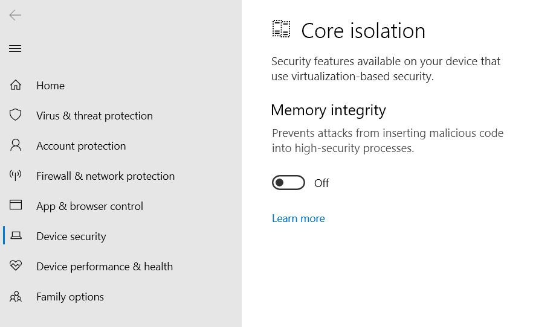
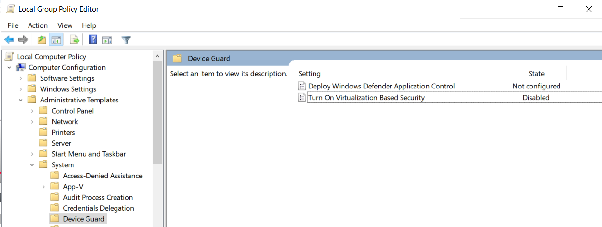
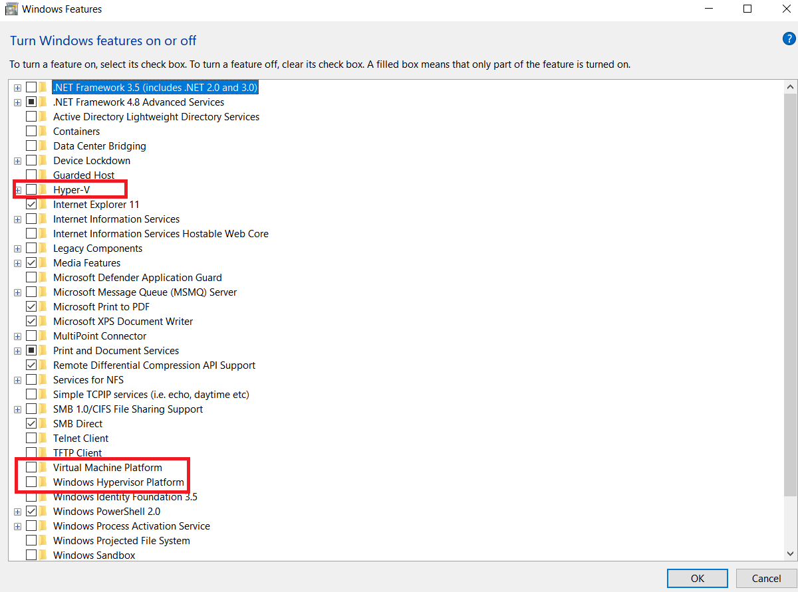

In case you meet this error when lauching the PnetLab in VMware Workstation:

```plaintext
Virtualized Intel VT-x/EPT is not supported on this platform.
Continue without virtualized Intel VT-x/EPT?
```
You choose Yes, then you will see the error message:

```plaintext
Virtualized Intel VT-x/EPT is not supported on this platform.
```

*This guide is tested on my machine: Windows 10 Pro 64-bit, CPU Intel 1235U, VMware Workstation Pro 17. Other systems may have slightly different.*

# Disable Hyper-V 

To fix this, follow these steps:

1. **Open window Powershell with administrator privilege and run**:

```shell
bcdedit /set hypervisorlaunchtype off
Disable-WindowsOptionalFeature -Online -FeatureName Microsoft-Hyper-V-All
# Type "n" to not restart the computer yet.

# In case meet error, try below command:
# Disable-WindowsOptionalFeature -Online -FeatureName HypervisorPlatform
```

2. **Go to Window Settings** -> Search for `Core Isolation` -> Click on `Core isolation details` -> Turn off `Memory integrity`.



3. **Search for  `Edit group policy` on Windows** search bar -> Computer Configuration -> Administrative Templates -> System -> Device Guard -> Turn on Virtualization Based Security -> Right click -> Edit -> Disable.



4. **Search for `Turn Windows features on or off` on Windows search bar**. Look at option:

- `Hyper-V` -> Need to be unchecked
- `Virtual Machine Platform` -> Need to be unchecked
- `Windows Hypervisor Platform` -> Need to be unchecked



Then restart the computer 

5. **Try to launch the PnetLab again**

The PnetLab VM now should be able to run without the error message. However, since the `Hyper-V` is disabled, you will not be able to run any other windows servies that requring `Hyper-V` such as Docker Desktop, WSL2, etc.

Refenrences: https://youtu.be/p76EhflJ1l0?si=AdlQtFex8kG9Tvxi


# Re-enable Hyper-V

Incase you need to re-enable the `Hyper-V` for other services, e.g Docker Desktop, do steps in reverse order:

1. Run Windows Powershell with administrator privilege and run:

```shell
bcdedit /set hypervisorlaunchtype auto
Enable-WindowsOptionalFeature -Online -FeatureName Microsoft-Hyper-V-All -All
Enable-WindowsOptionalFeature -Online -FeatureName HypervisorPlatform -All
Enable-WindowsOptionalFeature -Online -FeatureName VirtualMachinePlatform -All
```

2. Turn ON Memory Integrity (Core Isolation)

Go to Windows Settings → Search for Core Isolation -> Click Core Isolation Details.

3. Enable Virtualization-Based Security in Group Policy

Press `Windows + R`, type `gpedit.msc` and hit Enter -> Go to: Computer Configuration → Administrative Templates → System → Device Guard
Double-click "Turn on Virtualization Based Security" → Set to Enabled.

4.  Enable features in "Windows Features" menu

Search for `Turn Windows features on or off` in the Start menu.

Check these items:

✅ Hyper-V

✅ Virtual Machine Platform

✅ Windows Hypervisor Platform

Click OK, and wait for Windows to install them.


5. Final Step

Restart your computer
Once you've completed all of the above, restart your computer to apply the changes.


