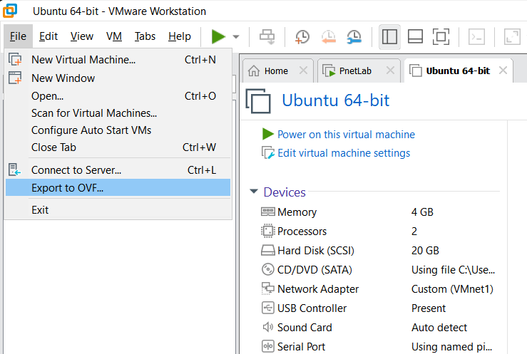
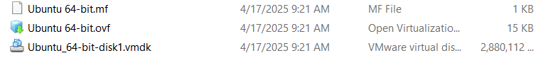
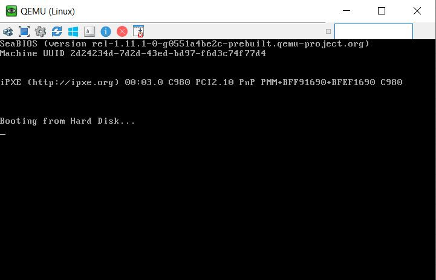

This guide will show you how to generate `qcow2` image files from a running instance VM in VMware Workstation Pro 17. This can help us reuse that VM setting without needing to reconfigure it again.

First, open VMware Workstation, choose that machine, click `File` -> `Export to OVF...` -> Choose the location to save the file -> Click `OK`.



Navigate to the directory, you will see a `.ovf` file and a `.vmdk` file. The `.ovf` file is the setting of the VM, and the `.vmdk` file is the disk image of that VM.



The `vmdk` file is the one we need to convert to `qcow2` format. In order to convert, we need a tool called `qemu-img`. To install, run PowerShell with admin privilege and run the [following command](https://www.powershellgallery.com/packages/install-qemu-img/1.1):

```powershell
Install-Script -Name install-qemu-img # This will download a install script
install-qemu-img.ps1 # Run that script to install qemu-img
```
Sample output:

```plaintext
PS C:\Windows\system32> install-qemu-img.ps1
[==>]Analyzing https://cloudbase.it/qemu-img-windows[done]
[==>]Downloading qemu-img-win-x64-2_3_0.zip[done]

Confirm
Are you sure you want to perform this action?
Performing the operation "Create Directory" on target "Destination: C:\Program Files\qemu".
[Y] Yes  [A] Yes to All  [N] No  [L] No to All  [S] Suspend  [?] Help (default is "Y"): Y
[==>]Adding qemu path to Environment[done]
PS C:\Windows\system32> qemu-img --version
qemu-img version 2.3.0, Copyright (c) 2004-2008 Fabrice Bellard
```

Then open PowerShell at the location of the Ubuntu vmdk file and run the following command to convert it to qcow2 format:

```powershell
qemu-img convert -f vmdk -O qcow2 <vmdk_file_name> <qcow2_file_name>
```
Sample output:

```plaintext
PS C:\Users\Chu Trung Anh\Downloads\ISO>  qemu-img convert -f vmdk -O qcow2 '.\Ubuntu_64-bit-disk1.vmdk' virtioa.qcow2
```

> [!IMPORTANT]  
> Why do I name the output file as `virtioa.qcow2`? -> The image must follow [naming convention by EVE](https://www.eve-ng.net/index.php/documentation/qemu-image-namings/): place it in `/opt/unetlab/addons/qemu/` under a subfolder named `linux-*`, `win-*`, or `winserver-*`, and name the image file `virtioa.qcow2` (with linux). **DO NOT** name this arbitrarily, otherwise PnetLab will not be able to find and load the image file.

In case you do not like using command line to create and copy files to VM, you can use software like WinSCP or FileZilla to do similar tasks. Just make sure to copy the file to the correct directory and name it as `virtioa.qcow2`.

We now have the qcow2 image file to use in PnetLab. By follow this guide, you can generate any qcow2 image file from a running instance VM in VMware Workstation Pro 17. However, some distro, like I tested with Parrot OS Security, can not be boot up in PnetLab if use this way:



> [!TIP]
> More devices' pre built `qcow2` image file can be found [here](https://cnttshop.vn/blogs/cong-cu-labs/chia-se-100g-file-ios-cua-cac-hang-su-dung-cho-eve-va-pnetlab)


