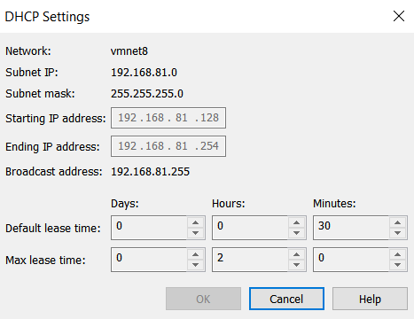

> [!IMPORTANT] 
> The version used to conduct this project is Ubuntu Server 24.04.2, VMware Workstation 17.6.3.

This guide explains the process of setting up a static IP address for Ubuntu Server. Do not use the exact IP address shown in this guide; modify it to fit your network environment.

# 🌐 Config static IP address for Ubuntu Server 

You would want to config a static IP address for your Ubuntu server since it will give you smooth operation without being interrupted by the changing of the IP address every time you restart the server. 

I will use SSH to config the static IP address for the Ubuntu server from my host machine. At first, login to the Ubuntu server and run `ip a` to see the current virtual machine IP address, then use that IP address to SSH to the server.

```bash
ssh chutrunganh@192.168.81.130
```

Once SSH is successful, follow the steps below on the host machine to configure the static IP address.

1. **Check the Current Network Configuration**

```bash
ip a
```
Sample output:

```plaintext
1: lo: <LOOPBACK,UP,LOWER_UP> mtu 65536 qdisc noqueue state UNKNOWN group default qlen 1000
    link/loopback 00:00:00:00:00:00 brd 00:00:00:00:00:00
    inet 127.0.0.1/8 scope host lo
       valid_lft forever preferred_lft forever
    inet6 ::1/128 scope host noprefixroute
       valid_lft forever preferred_lft forever
2: ens33: <BROADCAST,MULTICAST,UP,LOWER_UP> mtu 1500 qdisc fq_codel state UP group default qlen 1000
    link/ether 00:0c:29:19:25:39 brd ff:ff:ff:ff:ff:ff
    altname enp2s1
    inet 192.168.81.130/24 metric 100 brd 192.168.81.255 scope global dynamic ens33
       valid_lft 1566sec preferred_lft 1566sec
    inet6 fe80::20c:29ff:fe19:2539/64 scope link
       valid_lft forever preferred_lft forever
```

In this example, the network interface is `ens33` (not `lo`, which is the loopback interface) with IP address `192.168.81.130` with network mask `/24`.

2. **Find the default gateway**

```bash
ip route show
```
Sample output:

```plaintext
default via 192.168.81.2 dev ens33 proto dhcp src 192.168.81.130 metric 100
```
So the default gateway is `192.168.81.2`, remember this as we will use it later.

*You can also check this default gateway via VMware NAT settings. In VMware, go to `Edit` -> `Virtual Network Editor` -> `NAT Settings` and you will see the default gateway IP address.*

3. **Choose a Static IP Address**

Select an IP address **outside** the DHCP pool of your network to avoid conflicts. If you're using VMware, check the DHCP range via: `Edit` -> `Virtual Network Editor` -> `Choose the network you are using` -> `DHCP settings`. As in my case:



The range is from `192.168.81.128` to `192.168.81.254`, so I will use `192.168.81.10` as our static IP.

4. **Configure the Netplan Configuration File**

Ubuntu 18.04 LTS and later uses Netplan for network configuration. Check for existing configuration files:

```bash
ls /etc/netplan/
```

Sample output:

```plaintext
50-cloud-init.yaml
```

Netplan use multiple files to configure the network. There are 3 locations that netplan generate considers, [see detail](https://netplan.readthedocs.io/en/stable/netplan-generate/):

- `/lib/netplan/*.yaml`

- `/etc/netplan/*.yaml`

- `/run/netplan/*.yaml`

If:

- There are multiple files with exactly the same name, then only one will be read. A file in `/run/netplan` will shadow (completely replace) a file with the same name in `/etc/netplan`. A file in `/etc/netplan` will itself shadow a file in `/lib/netplan`. Or, in other words, `/run/netplan` is top priority, then `/etc/netplan`, with `/lib/netplan` having the lowest priority.


- There are files with different names, then they are considered in lexicographical order - regardless of the directory they are in. Later files add to or override earlier files. For example, `/run/netplan/10-xyz.yaml` would be updated by `/lib/netplan/20-abc.yaml`.

These files override/merge with each other in the following way:

- If the values are YAML boolean or scalar values (numbers and strings) the old value is overwritten by the new value.

- If the values are sequences, the sequences are concatenated - the new values are appended to the old list.

- If the values are mappings, Netplan will examine the elements of the mappings in turn using these rules.

Mostly, we will work with `/etc/netplan`. Inside this directory, there are already some config files by default. The presence and naming of these files can vary between systems due to differences in installation defaults, hardware configurations, or custom setups. Some common files you will find are:

| File Name               | Created By         | Description                              |
|-------------------------|--------------------|------------------------------------------|
| 00-installer-config.yaml | Ubuntu installer  | Usually DHCP setup for the primary interface                      |
| 50-cloud-init.yaml      | cloud-init (common in VM/cloud) | Dynamic or static setup for cloud/VM    |
| 01-netcfg.yaml          | Admin-defined      | Custom static IPs, routes, etc.         |
| 99-config.yaml          | Admin override     | Custom file created by admins to final override (high priority due to 99- prefix)       |


For this example, I am running this in VM, so I only have one file `50-cloud-init.yaml` in `/etc/netplan/` with the content as below, which indicates that the network interface `ens33` use IP address assigned by DHCP:

```yaml
network:
  version: 2
  ethernets:
    ens33:
      dhcp4: true
```

I will create a new file `99-static-ip.yaml`  (or any name with higher number than 50) to override the default config. You can also edit the existing file, but it is not recommended as it may be overwritten by cloud-init or other processes.


To create and edit the new file, run:

```bash
sudo nano /etc/netplan/99-static-ip.yaml
```

Copy and paste the following configuration into the file:

```yaml
network:
  version: 2
  ethernets:
    ens33:
      dhcp4: false
      addresses:
        - 192.168.81.10/24
      routes:
        - to: default
          via: 192.168.81.2
      nameservers:
        addresses:
          - 8.8.8.8
          - 8.8.4.4
```

Explanation:

- `dhcp4: false`: Disables DHCP for IPv4.
- `addresses`: Sets the static IP (192.168.81.10) with a /24 subnet mask.
- `gateway4`: Specifies the gateway (e.g., 192.168.81.2 from Step 3).
- `nameservers`: Uses Google’s public DNS servers (8.8.8.8 and 8.8.4.4) for name resolution. Otherwise, you can use CloudFlare public DNS server (1.1.1.1 and 1.0.0.1).
- `routes -to: default`: Specifies the default gateway, replace with the value you found in Step 2.

Save the file (in nano, press `Ctrl+O`, Enter, then `Ctrl+X` to exit).

5. **Apply the Changes**

Apply the new configuration by running:

```bash
sudo netplan apply
```
Then type `exit` to exit the SSH session, restart the virtual machine, and SSH back to the server using the new static IP address

In case you meet this warning when SSH back to the server:

```plaintext
@@@@@@@@@@@@@@@@@@@@@@@@@@@@@@@@@@@@@@@@@@@@@@@@@@@@@@@@@@@
@    WARNING: REMOTE HOST IDENTIFICATION HAS CHANGED!     @
@@@@@@@@@@@@@@@@@@@@@@@@@@@@@@@@@@@@@@@@@@@@@@@@@@@@@@@@@@@
```
Fix this by removing the old key:

```bash
ssh-keygen -R 192.168.81.10
ssh chutrunganh@192.168.81.10 # Then SSH again
```


6. **Verify the New IP Address**

Confirm that the new static IP is assigned:
  
```bash
ip a
```
Sample output:

```plaintext
2: ens33: <BROADCAST,MULTICAST,UP,LOWER_UP> mtu 1500 qdisc fq_codel state UP group default qlen 1000
    link/ether 00:0c:29:19:25:39 brd ff:ff:ff:ff:ff:ff
    altname enp2s1
    inet 192.168.81.10/24 brd 192.168.81.255 scope global ens33
       valid_lft forever preferred_lft forever
    inet6 fe80::20c:29ff:fe19:2539/64 scope link
       valid_lft forever preferred_lft forever
```
 
Verify that the server can reach the network and the internet (if you are using Bridge or NAT as the network type).

Ping the gateway:

```bash
ping 192.168.81.2 -c 2
```
```plaintext
PING 192.168.81.2 (192.168.81.2) 56(84) bytes of data.
64 bytes from 192.168.81.2: icmp_seq=1 ttl=128 time=0.328 ms
64 bytes from 192.168.81.2: icmp_seq=2 ttl=128 time=1.03 ms
--- 192.168.81.2 ping statistics ---
2 packets transmitted, 2 received, 0% packet loss, time 1056ms
rtt min/avg/max/mdev = 0.328/0.676/1.025/0.348 ms
```

Ping the internet (e.g., Google):

```bash
ping google.com -c 2
```

```plaintext
PING google.com (142.250.66.46) 56(84) bytes of data.
64 bytes from hkg12s26-in-f14.1e100.net (142.250.66.46): icmp_seq=1 ttl=128 time=41.4 ms
64 bytes from hkg12s26-in-f14.1e100.net (142.250.66.46): icmp_seq=2 ttl=128 time=43.1 ms

--- google.com ping statistics ---
2 packets transmitted, 2 received, 0% packet loss, time 1001ms
rtt min/avg/max/mdev = 41.383/42.247/43.111/0.864 ms
```

If both tests succeed, your static IP configuration is working correctly.

