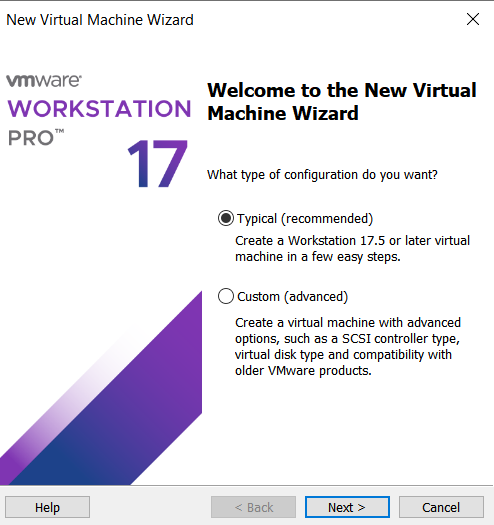
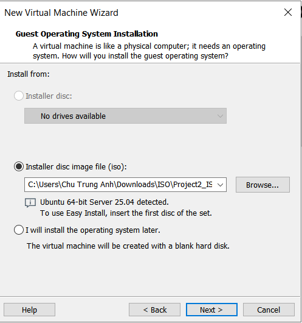
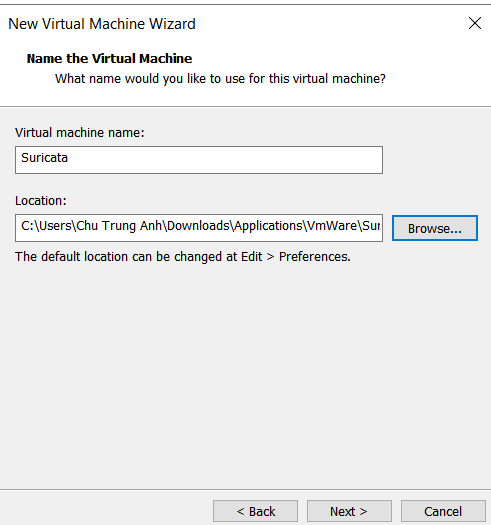
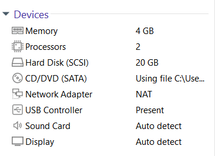
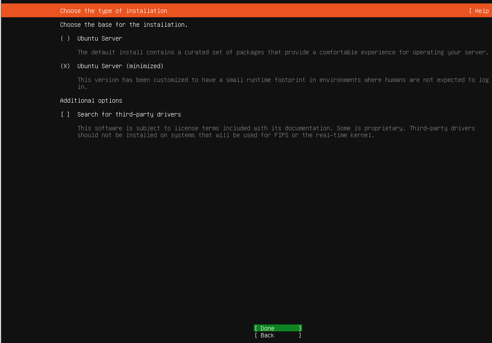
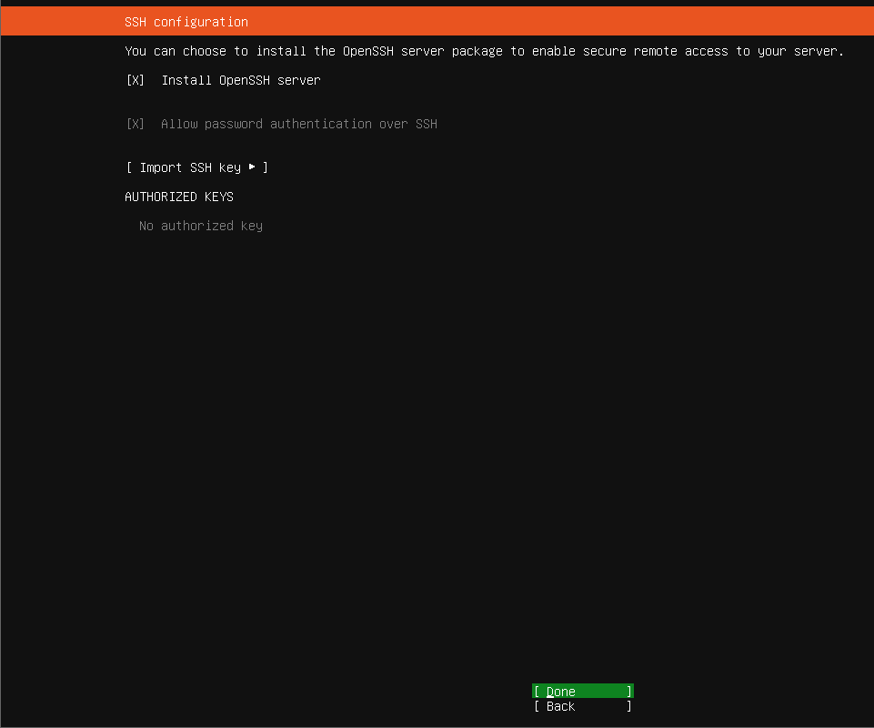

> [!IMPORTANT]
> In this file, I will show you how to set up Suricata IDS on a standalone VM using Ubuntu 24.04 LTS as the base OS. After testing and verifying that Suricata IDS is working correctly, I will export it as a `qcow2` image file and import it into PnetLab, where we have set up the entire network environment.

*At the time of writing, Ubuntu 25.04 is the latest version. However, it is not an LTS release yet, and the PPA does not yet provide the Suricata package for this version (as I have tested). Therefore, we will use Ubuntu 24.04 LTS for this lab.*


# 1. Install Ubuntu Server 24.04 VM

Create a new VM in VMware Workstation Pro 17:



Choose the ISO file of Ubuntu Server 24.04 LTS that you have downloaded.



Name the VM as you prefer and choose the location to save it. We will use several VM files in this lab so it is recommended to create a new separate folder for each VM.



Everything else can be left as default, or modify based on your machine configuration. After that the VM will be created, before you start the machine, recheck the network adapter setting of this VM, make sure it has the adapter type that can connect to the Internet (such as Bridge or NAT, which should be the default setting while installing).




Then start the VM, at this step, I choose the minimal installation option for lowest resource usage:


*Press Arrow Down to select the option, then press Space to select it, then move to the bottom (Done) and press Enter to continue.*

Press Enter to for next steps. Remember to choose `Install OpenSSH server` option, so that you can connect to this VM via SSH later.



Then wait until the installation is complete. This may take a few minutes, after that we can SSH to this VM from the host machine.

To SSH from host machine, first you still need to login to the VM console  then run the following commands:

```bash
ip a # To see the IP address that we need to SSH to
sudo systemctl status ssh # To check if SSH service is running
# Incase the SSH service is not running or on error, it is likely that the key haven't been generated for the first time yet, run this command: "sudo ssh-keygen -A" should fix the issue
```

# 2. Install Suricata IDS on the VM

Now we can SSH to the VM from the host machine. Open a terminal on your host machine and run:

```bash
ssh chutrunganh@192.168.249.129 # Replace with your VM username and IP address, this will let us enter the VM console

# Once entered, run these commands:
sudo apt update
sudo apt install open-vm-tools # Install VMware tools for better performance and integration (recommended, not install this can sometime cause some issues when displaying the VM console, related to the GPU)
sudo apt install nano iputils-ping -y
# If you choose to install the minimal Ubuntu Server install option, these tools are not installed by default, so we need to install them manually. Make sure to choose the NAT or Bridge network adapter type so that the VM can connect to the Internet and install packages.
```

*In case you encounter some issues with displaying the VM console, try to install the VMware tools as shown above, or you can also disable `3D Acceleration graphics` in the VM settings: Click on that VM -> Edit -> Display -> **uncheck `Accelerate 3D graphics` option**, this may fix with the display issues.*

Now we can install Suricata IDS on this VM.

```bash
sudo apt install software-properties-common
sudo add-apt-repository ppa:oisf/suricata-stable # Add the Suricata PPA repository
sudo apt update # Update the package list
sudo apt install suricata -y # Install Suricata IDS
sudo systemctl enable suricata # Enable Suricata to start on boot
```
Expected output:

```plaintext
chutrunganh@chutrunganh:~$ sudo systemctl enable suricata
Synchronizing state of suricata.service with SysV service script with /usr/lib/systemd/systemd-sysv-install.
Executing: /usr/lib/systemd/systemd-sysv-install enable suricata
```
We can check for the status of Suricata service by running:

```bash
sudo systemctl status suricata
```

Expected output:

```plaintext
chutrunganh@chutrunganh:~$ sudo systemctl status suricata
● suricata.service - LSB: Next Generation IDS/IPS
     Loaded: loaded (/etc/init.d/suricata; generated)
     Active: active (exited) since Mon 2025-06-02 17:42:30 UTC; 11s ago
       Docs: man:systemd-sysv-generator(8)
        CPU: 118ms

Jun 02 17:42:30 chutrunganh systemd[1]: Starting suricata.service - LSB: Next Generation IDS/IPS...
Jun 02 17:42:30 chutrunganh suricata[2287]: Starting suricata in IDS (af-packet) mode... done.
Jun 02 17:42:30 chutrunganh systemd[1]: Started suricata.service - LSB: Next Generation IDS/IPS.
```

# 3. Configure Suricata IDS

## Initial Configuration

By default, when install, Suricata works in IDS mode, (to enable IPS will require futher configuration, which is not covered in this lab). We can check the Suricata configuration file at `/etc/suricata/suricata.yaml`.

```bash
sudo nano /etc/suricata/suricata.yaml
```

Here are some important settings that you may want to change:

- **`HOME_NET`**: This is the network address range that Suricata will monitor. Change this to match your network. 
  
```yaml
vars:
  # more specific is better for alert accuracy and performance
  address-groups:
    HOME_NET: "[192.168.0.0/16,10.0.0.0/8,172.16.0.0/12]"
    #HOME_NET: "[192.168.0.0/16]"
    #HOME_NET: "[10.0.0.0/8]"
    #HOME_NET: "[172.16.0.0/12]"
    #HOME_NET: "any"
```

- **`default-log-dir`**: This is the directory where Suricata will store its log files. Just need to view, no need to change this.

```yaml
default-log-dir: /var/log/suricata/
# Global stats configuration
stats:
  enabled: yes
  # The interval field (in seconds) controls the interval at
  # which stats are updated in the log.
  interval: 8
  # Add decode events to stats.
outputs:
  # a line based alerts log similar to Snort's fast.log
  - fast:
      enabled: yes
      filename: fast.log
      append: yes

  # Extensible Event Format (nicknamed EVE) event log in JSON format
  - eve-log:
      enabled: yes
      filetype: regular #regular|syslog|unix_dgram|unix_stream|redis
      filename: eve.json

      ...
      # enable/disable the community id feature.
      community-id: false
      # Seed value for the ID output. Valid values are 0-65535.
      community-id-seed: 0
```

By default, Suricata will log its alerts to `/var/log/suricata/`, it offers two main types of log. When an event occurs, Suricata will log out that events in both log files:
- **`fast.log`**: This log file contains a concise, just a text line,  human-readable summary of alerts.
- **`eve.json`**: This is a more detailed log file in JSON format, which purpose is for depper analysis and integration with other tools that collect and analyze logs, such as ELK stack or Splunk. To integrate with these tools, you also need to enable the `Community ID` feature, cahnge it to `true` in the configuration file. This ID is used to uniquely identify events across different systems and tools, allowing logs from different sources to be mergered together in a consistent timeline.

- **`af-packet`**: This is the interface that Suricata will use to capture network traffic. Make sure it is set to the correct interface that you want to monitor. You can find your network interfaces by running `ip a` command.

```yaml
af-packet:
  - interface: eth0
  cluster-id: 99
```

In the VM, the network interface is usually named as `ens33` so remember to change this. In case you want to use multiple interfaces, you can add more entries under the `af-packet` section like this:

```yaml
af-packet:
  - interface: ens33
    cluster-id: 99
  - interface: ens34
    cluster-id: 100
```
Notice that the `cluster-id` of each interface must be unique.

- **`default-rule-path`**: This is the path where Suricata will look for its rules files. By default, it is set to `/var/lib/suricata/rules`. You can change this if you want to store your rules in a different location.

```yaml
rule-path: /var/lib/suricata/rules
rule-files:
  - suricata.rules
```

## Live Rules Loading

Suricata supports live rules loading, which means you can add or remove rules without restarting Suricata. This is useful for testing new rules or updating existing ones without downtime. Reopen the Suricata configuration file, move to the end of the file, and add the following lines:

```yaml
detect-engine:
  - rule-reload: true
```

With this, when never you add or remove rules, you can run the following command to reload the rules without restarting Suricata: (see more detail [here](https://docs.suricata.io/en/latest/rule-management/rule-reload.html)

```bash
kill -USR2 $(pidof suricata)
```
## Add Rules

You can write adn add youe own rules to Suricata (which we will do in later sections), or you can use the rules that are pre-writen by many providers. Suricata offers a tool called `suricata-update` to manage these. We use:

```bash
sudo suricata-update update-sources # for Suricata to update its provider sources first
suricata-update list-sources
``` 
to list all available sources of rules. You can choose one or more sources to use.

Expected output:

```plaintext
Name: et/open
  Vendor: Proofpoint
  Summary: Emerging Threats Open Ruleset
  License: MIT
Name: et/pro
  Vendor: Proofpoint
  Summary: Emerging Threats Pro Ruleset
  License: Commercial
  Replaces: et/open
  Parameters: secret-code
  Subscription: https://www.proofpoint.com/us/threat-insight/et-pro-ruleset

....

Name: stamus/nrd-phishing-14-open
  Vendor: Stamus Networks
  Summary: Newly Registered Domains Open only - 14 day list, phishing
  License: Commercial
  Parameters: secret-code
  Subscription: https://www.stamus-networks.com/stamus-labs/subscribe-to-threat-intel-feed
Name: pawpatrules
  Vendor: pawpatrules
  Summary: PAW Patrules is a collection of rules for IDPS / NSM Suricata engine
  License: CC-BY-SA-4.0
Name: ptrules/open
  Vendor: Positive Technologies
  Summary: Positive Technologies Open Ruleset
  License: Custom
Name: aleksibovellan/nmap
  Vendor: aleksibovellan
  Summary: Suricata IDS/IPS Detection Rules Against NMAP Scans
  License: MIT
```
Rules with `Commercial` license require a subscription to use, so we will not use them in this lab.  In this project, I will use the `et/open` ruleset, which is free to use. To add this ruleset, run:

```bash
sudo suricata-update enable-source et/open
```

Then run the following command to update the rules:

```bash
sudo suricata-update update
```

After all the config, run the Suricata in test mode to check if everything is working correctly:

```bash
sudo suricata -T -c /etc/suricata/suricata.yaml -v
```

With the `-T` option, Suricata will run in test mode and check the configuration file for any errors. The `-c` option specifies the configuration file to use, and the `-v` option enables verbose output.
Expected output:

```plaintext
Notice: suricata: This is Suricata version 7.0.10 RELEASE running in SYSTEM mode
Info: cpu: CPUs/cores online: 2
Info: suricata: Running suricata under test mode
Info: suricata: Setting engine mode to IDS mode by default
Info: exception-policy: master exception-policy set to: auto
Info: logopenfile: fast output device (regular) initialized: fast.log
Info: logopenfile: eve-log output device (regular) initialized: eve.json
Info: logopenfile: stats output device (regular) initialized: stats.log
Info: detect: 1 rule files processed. 43756 rules successfully loaded, 0 rules failed, 0
Info: threshold-config: Threshold config parsed: 0 rule(s) found
Info: detect: 43759 signatures processed. 1222 are IP-only rules, 4359 are inspecting packet payload, 37958 inspect application layer, 109 are decoder event only
Notice: suricata: Configuration provided was successfully loaded. Exiting.
```

If things go well, you should see a message indicating that Suricata is running in test mode and that the configuration file was successfully loaded. Then we can start to run the Suricata in daemon mode:

```bash
sudo systemctl start suricata
sudo systemctl status suricata
```

If any erros occur, you can check the Suricata runtime log file for more details:
```bash
tail -f /var/log/suricata/suricata.log
```
*This is the log file of Suricata runtime, not the alert log file.*