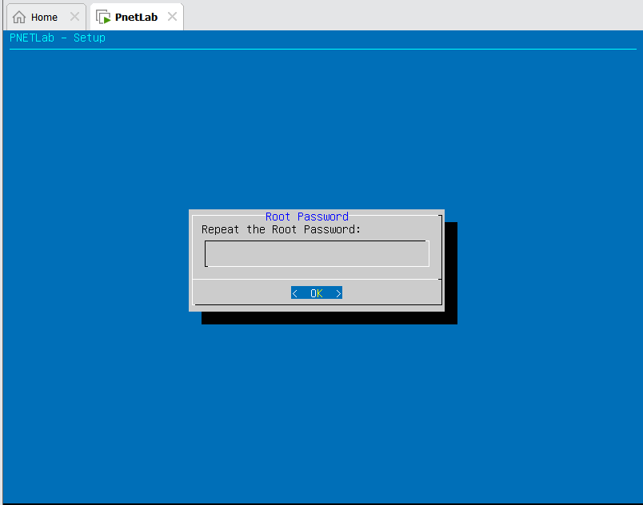

# 1. Required Software

In this project, my goal is to create a simulated enterprise network. To do this, I will use the following software:

- Vmware Workstation Pro 17.0.2
- PnetLab

Together with image files of some network devices and operating systems:

- Ubuntu Server 24.04.2 LTS
- Kali linux 
- Cisco IOU images (see in attached folder)

## 1.1 VMware Workstation

This is a virtualization software that allows you to run multiple operating systems on a single physical machine. In the scope of this project, i will use Vwareare Workstation:

- Run Ubuntu Server and Parrot Security OS as virtual machines when learning about configure Suricata IDS as a standalone system

- Run PnetLab as a virtual machine to create a simulated enterprise network

## 1.2 PnetLab

Some popular tools for network simulation include:

| Software            | Type                  |
|---------------------|-----------------------|
| GNS3 VM            | Emulator & Simulator |
| EVE-NG             | Emulator             |
| PnetLab            | Emulator             |
| Cisco Packet Tracer | Simulator            |

*Emulator: Runs real OS/network software (e.g., Cisco IOS) on virtualized hardware, closely mimicking real devices.*

*Simulator: just models behavior abstractly, lacking real OS/software, less capability than emulators.*


First, let’s briefly introduce UNetLab (Unified Networking Lab) an emulator platform based on Linux, designed to run real network device images. You can think of UNetLab as a hypervisor for network device images, which are normally used on physical devices or separate virtual machines.

The great thing about UNetLab is that everything runs inside a single virtual machine, and you use a web interface to create and manage your labs. You just upload the device images and start configuring your lab. It allows you to simulate network devices like switches, routers, firewalls, and even end-user devices, so you can test network designs and how they work in real-life situations.

The EVE-NG (Emulated Virtual Environment Next Generation) is a descendant of UNetLab, including two versions: Community and Professional. PnetLab is a fork of EVE-NG Community, with extra features

In this lab, I will use PnetLab to create a simulated enterprise network, but incase you use EVE-NG, the process is quite similar.

### 1.2.1 Installing PnetLab

1. Download the PnetLab OVA file from the [PnetLab  official website](https://pnetlab.com/pages/download).

2. Once downloaded, you will see a file named `PNET_<version>.ova` in your Downloads folder. Right click an open it with Vmware

    

    Name the VM as you wish and choose the location where you want to save it. The size of VM is quite large, so make sure you have enough space on your disk. 

    

    Click on `Edit virtual machine settings` to configure the VM.

    

    Adjust the ammount of RAM and CPU cores according to your needs. Under Processor tab, check the `Virtualize Intel VT-x/EPT or AMD-V/RVI` checkbox.

    
    
    Virtualize Intel VT-x/EPT is a deep virtulization technology that allows many layers of virtualization, in our case, we use this feature to virtualize Linux/ Windows virtual machines inside the PnetLab, which is already a virtual machine. When you uncheck this option, PnetLab will still run but you will not be able to run simulated Operational System (OS) like Linux, Windows host inside the PnetLab. **Note that this feature will require turning the Hyper-V off**. When tick this option, you may see error message like this: 

    ```plaintext
    Virtualized Intel VT-x/EPT is not supported on this platform.
    ```
    In that case, refer to the [Appendix](../Appendix/Fix%20Virtualized%20Intel%20VT.md) section to fix this issue.

    By default, PnetLab chooses 2 network interfaces: **NAT** and **Bridged**. Under the VMware home menu tab, click on `Edit` -> `Virtual Network Editor` -> `Change Settings` to see the range of these interfaces. You can change the range of IP addresses for these interfaces if you want.

    
    *Bridge interface*

    
    *NAT interface, **notice the IP address range***

    Also, check the **Gateway** of this NAT network by clicking on `NAT settings...` button

    

    Power on the PnetLab VM and wait for it to boot up. You will see a screen like this:

    

    Type `root` as default username, then press Enter, type `pnet` as default password to login (Passwork will not be shown when typing). Then go though some others setting:

    
    *Enter a new password*

    Default domain name for the system, let as it is. 
    
    

    Then configure the IP address settings. By default, this IP address belongs to the NAT interface in VMware. To config: Press Down arror to move to `static` -> press `Space` to choose -> press Enter -> Type the IP address. Choose an IP address that belong to the NAT network, which mean the IP address must have form like `192.168.249.x` with x must be outside the IP range of DHCP by NAT interface to avoid any potential conflict. In this case I choose `192.168.249.10/24`

    

    

    

    

    *Enter the gateway address we checked earlier in NAT settings*

    

    *Choose any DNS server like 8.8.8.8, 8.8.4.4 from Google or 1.1.1.1 from Cloudflare*. Then type the second DNS server as the same as the first one. This is optional, but it’s a good practice to have a backup DNS server in case the first one fails.

    Then press Enter for the rest of the settings, you can change them later if you want, just by login again -> Type `rm -f /opt/ovf/.configured` to remove startup configuration file -> Type `su -` to re-initialize the startup configuration file.

    After the machine restart, you can access the web GUI by the URL shown on screen.

    
  
    There are two modes to login in PnetLab: **Online** and **Offline**. The Online mode requires an internet connection and allows you to use lab excercises on PnetLab store, sell your lab excercises. The Offline mode allows you to create your own labs without an internet connection.

    

    In this lab, I will use the Offline mode, so I will choose the **Offline** mode., login by default credentials:

    

    After that, create a new lab to start working with PnetLab.

    

    Right now, we can the lab interface, but in order to interact with devices in the lab, we will need to install [Windows Client Pack](https://www.eve-ng.net/index.php/download/#DL-WIN) which contain necessary tools like VNC Viewer, Putty, etc. to connect to the devices in the lab. *The window client pack comes from EVE-NG but compatible with PnetLab*

    

### 1.2.2 Installing Cisco IOL (IOS) images

#### Download Cisco IOL images

**First, what is Cisco IOL?**

Cisco IOS is a Linux-based operating system used on Cisco routers and switches, on Linux, this terminology is called as **IOL**, on Unix, it is called as **IOU**. The IOL images are used to run Cisco IOS on a virtual machine, which allows you to simulate Cisco devices without needing physical hardware.

Since Cisco has thousands of devices, there are also thousands of IOL images for different devices. However, there are 5 most recommended images for PnetLab/EVE-NG as suggested by the [EVE-NG official website](https://www.eve-ng.net/index.php/documentation/howtos/howto-add-cisco-iol-ios-on-linux/):

| Type         | Image Name                                              | Version                                                                 | NVRAM | RAM  |
|--------------|----------------------------------------------------------|-------------------------------------------------------------------------|-------|------|
| L2/L3 Switch | i86bi_linux_l2-adventerprisek9-ms.SSA.high_iron_20190423.bin | Cisco IOS Software, Linux Software (I86BI_LINUXL2-ADVENTERPRISEK9-M), Version 15.2(CML_NIGHTLY_20190423) | 1024  | 1024 |
| L2/L3 Switch | i86bi_LinuxL2-AdvEnterpriseK9-M_152_May_2018.bin         | Cisco IOS Software, Linux Software (I86BI_LINUXL2-ADVENTERPRISEK9-M), Version 15.2(CML_NIGHTLY_20180510)FLO_DSGS7 | 1024  | 1024 |
| L3 Router    | i86bi_LinuxL3-AdvEnterpriseK9-M2_157_3_May_2018.bin      | Cisco IOS Software, Linux Software (I86BI_LINUX-ADVENTERPRISEK9-M), Version 15.7(3)M2, Compiled Wed 28-Mar-18 11:18 by prod_rel_team | 1024  | 1024 |
| L3 Router    | i86bi_linux-adventerprisek9-ms.156-3.M3a.bin             | Cisco IOS Software, Linux Software (I86BI_LINUX-ADVENTERPRISEK9-M), Version 15.6(3)M3a, Compiled Tue 19-Sep-17 10:03 by prod_rel_team | 1024  | 1024 |
| L3 Router    | L3-ADVENTERPRISEK9-M-15.4-2T.bin                         | Cisco IOS Software, Linux Software (I86BI_LINUX-ADVENTERPRISEK9-M), Version 15.4(2)T4, Compiled Thu 08-Oct-15 21:21 by prod_rel_team | 1024  | 1024 |

*Switch L3 can be used as a router between VLANs*

All these files as well as Crack scripts are included in the attached folder.


#### Install Cisco IOL images to PnetLab

Copy all these aboves file to the `/opt/unetlab/addons/iol/bin/` directory in PnetLab VM. You can use SSH or sfotware like WinSCP/ FileZilla to copy files to the PnetLab VM. in my case I choose SSH since I no need to download any extra software.

From the folder location of these files, open the Windown PowerShell and run the following command to copy files to the PnetLab VM:

```powershell
PS C:\Users\Chu Trung Anh\Downloads\ISO\Project2_ISO\Network_devices> dir


    Directory: C:\Users\Chu Trung Anh\Downloads\ISO\Project2_ISO\Network_devices


Mode                 LastWriteTime         Length Name
----                 -------------         ------ ----
-a----         4/15/2025  10:00 PM           1056 CiscoIOUKeygen.py
-a----         4/15/2025  10:00 PM      183841192 i86bi_linux-adventerprisek9-ms.156-3.M3a.bin
-a----         4/15/2025  10:00 PM      126226692 i86bi_LinuxL2-AdvEnterpriseK9-M_152_May_2018.bin
-a----         4/15/2025  10:00 PM      184759244 i86bi_LinuxL3-AdvEnterpriseK9-M2_157_3_May_2018.bin
-a----         4/15/2025  10:00 PM      126249700 i86bi_linux_l2-adventerprisek9-ms.SSA.high_iron_20190423.bin
-a----         4/15/2025  10:00 PM             38 iourc
-a----         4/15/2025  10:00 PM      159350476 L3-ADVENTERPRISEK9-M-15.4-2T.bin


PS C:\Users\Chu Trung Anh\Downloads\ISO\Project2_ISO\Network_devices> scp * root@192.168.249.10:/opt/unetlab/addons/iol/bin/
The authenticity of host '192.168.249.10 (192.168.249.10)' can't be established.
ED25519 key fingerprint is SHA256:jUFSA4j+viXJ2ZdgBSVcWzpyIOFotG3CsWZI0jO86F0.
This key is not known by any other names.
Are you sure you want to continue connecting (yes/no/[fingerprint])?
Warning: Permanently added '192.168.249.10' (ED25519) to the list of known hosts.
root@192.168.249.10's password:
CiscoIOUKeygen.py                                                                                                           100% 1056   515.7KB/s   00:00
L3-ADVENTERPRISEK9-M-15.4-2T.bin                                                                                            100%  152MB 145.7MB/s   00:01
i86bi_LinuxL2-AdvEnterpriseK9-M_152_May_2018.bin                                                                            100%  120MB 137.1MB/s   00:00
i86bi_LinuxL3-AdvEnterpriseK9-M2_157_3_May_2018.bin                                                                         100%  176MB 122.1MB/s   00:01
i86bi_linux-adventerprisek9-ms.156-3.M3a.bin                                                                                100%  175MB 143.1MB/s   00:01
i86bi_linux_l2-adventerprisek9-ms.SSA.high_iron_20190423.bin                                                                100%  120MB 137.4MB/s   00:00
iourc                                                                                                                       100%   38    37.1KB/s   00:00
PS C:\Users\Chu Trung Anh\Downloads\ISO\Project2_ISO\Network_devices>
```

The IP to SSH to is the static IP we set earlier, host name is `root` and password is `pnet` by default

Now SSH to the PnetLab VM and check if these files are copied successfully:

```plaintext
PS C:\Users\Chu Trung Anh\Downloads\ISO\Project2_ISO\Network_devices> ssh root@192.168.249.10
root@192.168.249.10's password:
root@pnetlab:~# cd /opt/unetlab/addons/iol/bin/
root@pnetlab:/opt/unetlab/addons/iol/bin# ls
CiscoIOUKeygen.py                                 i86bi_linux_l2-adventerprisek9-ms.SSA.high_iron_20190423.bin  keepalive.pl
i86bi_linux-adventerprisek9-ms.156-3.M3a.bin      i86bi_LinuxL3-AdvEnterpriseK9-M2_157_3_May_2018.bin           L3-ADVENTERPRISEK9-M-15.4-2T.bin
i86bi_LinuxL2-AdvEnterpriseK9-M_152_May_2018.bin  iourc
root@pnetlab:/opt/unetlab/addons/iol/bin#
```

Then run the crack script to get the license key for these images:

```plaintext
root@pnetlab:/opt/unetlab/addons/iol/bin# python3 CiscoIOUKeygen.py
*********************************************************************
Cisco IOU License Generator - Kal 2011, python port of 2006 C version
Modified to work with python3 by c_d 2014
hostid=007f0101, hostname=pnetlab, ioukey=7f03e7

Add the following text to ~/.iourc:
[license]
pnetlab = b12XXXXXXXXXXXX;
```
Then open the `iourc` file and add the license key to it:

```plaintext
root@pnetlab:/opt/unetlab/addons/iol/bin# nano iourc
```

Update the permission so that IOL images can be run by PnetLab:

```plaintext
root@pnetlab:/opt/unetlab/addons/iol/bin# /opt/unetlab/wrappers/unl_wrapper -a fixpermissions
```


Back the the PnetLab  Web GUI -> reload the webpage -> right click on the screen and select `Add node` to add a new node to the lab.


Type `Cisco IOL` in the search box, then select `Cisco IOL` 


Some fields are:

- Number of nodes to add: the number of devices you want to add to the lab
- Image: choose the image you want to use for the device, which is the IOL image we just installed
- Name/prefix: the name of the device, you can choose any name you want, but it’s a good practice to use a meaningful name that describes the device’s role in the network such as `R` for router, `SW` for switch, etc.
- Icon: the icon that represents the device in the lab
- NVRAM: NVaram is a non-volatile random access memory, which is used to store the configuration of the device, let it as default
- RAM: the amount of RAM allocated to the device, let it as default
- Serial: Number of serial ports on the device, 1 group = 4 serial ports. 
- Ethernet: Number of ethernet ports on the device, 1 group = 4 ethernet ports.

Serial or Ethernet are both types of physical interfaces on the device, but Ethernet is more common in modern devices


*Ethernet cable and Serial cable*

Right click on the node and select `Start` to power on the device.


The double click on the device to open the console (connect via Putty) to configure the device. 


Tạo tương tự một Router


### 1.2.3 Installing Queme virtual images to PnetLab

QEMU, short for Quick Emulator, is an open-source emulator and virtualization tool. It is used by platforms like PnetLab and EVE-NG to run virtual machines with operating systems such as Windows or Linux inside them

QEMU can take advantage of hardware virtualization extensions to enhance performance. In particular, when combined with KVM (Kernel-based Virtual Machine) on Linux, QEMU can utilize virtualization technology to run virtual machines directly on the hardware without emulating the CPU, resulting in significantly better performance.


#### Prepare the OS image files

This section will guide you through the process of installing QEMU virtual images into PnetLab. This setup allows us to run full Windows/Linux virtual machines inside the PnetLab environment. With these virtual machines, we can install and run any software we need—just like on a real PC.

This is different from simulators like Cisco Packet Tracer, where the "PC" object has only limited, pre-defined capabilities. Packet Tracer only simulates some PC functions without running a full operating system. In contrast, QEMU-based virtual machines in PnetLab actually run complete OSes, providing a much more realistic and flexible environment

OS installation files can be have serveral formats due to their different purposes, such as:

- **Disk Image File Extensions (For OS installers, system backups)**

| Extension | Format Name            | Description                                           |
|-----------|------------------------|-------------------------------------------------------|
| .iso      | ISO Image              | Standard disc image format, commonly used for OS installers (Linux, Windows) |
| .img      | Raw Disk Image         | Uncompressed raw image of a disk or partition         |
| .dmg      | Apple Disk Image       | Used on macOS for distributing software and OS images |
| .wim      | Windows Imaging        | Used by Microsoft to deploy Windows images           |
| .esd      | Electronic Software Download | Compressed version of Windows installation files |

- **Virtual Machine Image Extensions (For virtual machines)**

| Extension | Format Name                  | Description                                                                 |
|-----------|------------------------------|-----------------------------------------------------------------------------|
| .vdi      | VirtualBox Disk              | Used by Oracle VirtualBox                                                  |
| .vmdk     | VMware Disk                  | Used by VMware products                                                    |
| .vhd      | Virtual Hard Disk            | Microsoft Hyper-V (older format)                                           |
| .vhdx     | Virtual Hard Disk (Extended) | Newer version of VHD for Hyper-V                                           |
| .qcow     | QEMU Copy-on-Write           | Original QEMU disk format                                                  |
| .qcow2    | QEMU Copy-on-Write v2        | Improved version, supports compression & snapshots                         |
| .raw      | Raw disk                     | Basic binary dump of a disk, used in QEMU and others                       |
| .ova      | Open Virtual Appliance       | Exported VM package (OVF + disk image)                                     |
| .ovf      | Open Virtual Format          | Metadata file used with .vmdk or .vdi in .ova packages   
                

- **Specialized Formats for Network Devices Emulators**

| Extension    | Emulator / Platform      | Format Type             | Description                                                                 |
|--------------|--------------------------|-------------------------|-----------------------------------------------------------------------------|
| .ios         | GNS3, Dynamips           | Cisco IOS Image         | Used to emulate older Cisco routers (e.g., 7200 series). Not official for modern Cisco use. |
| .bin         | Cisco devices            | Cisco Binary Image      | Used for real Cisco hardware; can be adapted for emulation in some tools.   |
| .qcow2       | GNS3, EVE-NG, QEMU       | QEMU disk image         | Common for newer VM-based appliances like vIOS, ASA, FortiGate, etc.        |
| .vmdk        | VMware / GNS3 / EVE-NG   | VMware Virtual Disk     | Can be used for network OS VMs (e.g., Palo Alto, Cisco vWLC).               |
| .vdi         | VirtualBox / GNS3        | VirtualBox Disk         | Occasionally used if VirtualBox is the underlying VM backend.               |
| .ova         | EVE-NG, GNS3, VMware     | Open Virtual Appliance  | Pre-packaged VMs with OVF + disk (e.g., Cisco vMX, Palo Alto VM).           |
| .img         | GNS3, QEMU               | Raw disk image          | Lightweight Linux appliances (e.g., VyOS, pfSense).                         |
| .dockerfile  | GNS3 with Docker         | Docker Image Descriptor | For container-based network functions.                                      |


The most optimized image format that PnetLab supports is **`.qcow2`** (since it uses QEMU as the hypervisor), **`.iso`** can also be used but is not optimal for virtual machines as it is designed for CD/DVD images. However, not all operating systems are available in this format. Most Linux distribution editions for running in virtualization environment are provided in **.vmdk** format (to use with VMware) or **.vdi** format (to use with VirtualBox). But these formats can be converted to **.qcow2** format using tools like `qemu-img`. 

In this project, I use to Linux distribution as the operating system for the virtual machines:

- Kali linux, which already has a `.qcow2` image file available for download from the [official website](https://www.kali.org/get-kali/#kali-virtual-machines).

- Ubuntu Server 24.04.2 LTS, which I will reuse the `.vmdk` image file of an instance that is already running in my VMware Workstation. See the process of converting from an existing running instance to `.qcow2` format in the [Appendix](../Appendix/Generate%20qcow2%20image%20files.md) section.

> [!TIP]
> More devices' pre built `qcow2` image file can be found [here](https://cnttshop.vn/blogs/cong-cu-labs/chia-se-100g-file-ios-cua-cac-hang-su-dung-cho-eve-va-pnetlab)


#### Install QEMU images to PnetLab

After have all the image file in `qcow2` format, we need to copy them to the PnetLab VM. The process is similar to how we installed Cisco IOL images, but with a different path.

> [!IMPORTANT]  
> The `qcow2` image file in your local machine can be in any name, but when copying to the PnetLab VM, the image must follow [naming convention by EVE](https://www.eve-ng.net/index.php/documentation/qemu-image-namings/): place it in `/opt/unetlab/addons/qemu/` under a subfolder named `linux-*`, `win-*`, or `winserver-*`, and name the image file exactly as `virtioa.qcow2` (with linux). **DO NOT** name this arbitrarily, otherwise PnetLab will not be able to find and load the image file.

Here I will try with Ubunt Server image first, the kali linux can be done in the same way. Open the PowerShell at the location of the `qcow2` file and run: 

```bash
ssh root@192.168.249.10 # SSH to the PnetLab VM to create the directory for the image file
mkdir /opt/unetlab/addons/qemu/linux-ubuntu/ # Create the directory for the image file
exit # Exit the SSH session, go back to the PowerShell session
scp .\virtioa.qcow2 root@192.168.249.10:/opt/unetlab/addons/qemu/linux-ubuntu/ # Copy the file to the PnetLab VM
ssh root@192.168.249.10 # SSH to the PnetLab VM again
cd /opt/unetlab/addons/qemu/linux-ubuntu/ 
ls ## Check if the file is copied successfully
/opt/unetlab/wrappers/unl_wrapper -a fixpermissions # Give the permission to the image file
```
In case you do not like using command line to create, copy file to VM, you can use software like WinSCP or FileZilla to do similar task. Just make sure to copy the file to the correct directory and name it as `virtioa.qcow2`.


*GUI in WinSCP*

After copy to PnetLab successfully, reload the PnetLab web page and add a new node to the lab, type `linux` in the search box, select `Linux` and fill in the fields as below:


Right click, choose `Start` to power on the device, then double click on the device to open QEMU


Do similar with the Kali Linux image, but this time create a new directory called `linux-kali` and name the image file inside as `virtioa.qcow2`


> [!TIP]
> To save the current imagestate as a template for future use that you do not have to reconfigure the image again, right click then choose `Node Commit` -> `Commit to original Image`. After that, wee will see the `virtioa.qcow2` file increase significantly in size. This is because the image file now contains the current state of the image, including all the changes made to it since it was first created. 


### 1.2.4 Connect PnetLab to the Internet

To connect virtual mchines in PnetLab to the internet, we need to add a Net object to the lab. This Net object will act as a virutal switch that connects all the devices in the lab to VMware network, in out case is the VMnet8 (NAT) interface. To create a Net object, right click on the screen and select `Network`:


In this setup, the Net objects in PNETLab are mapped in order to the network adapters assigned in VMware. For example, if the first network adapter you assign to the PNETLab VM in VMware is NAT, then the first network object (Cloud0) will connect to the NAT interface. If the second adapter is Bridged, then the second network object (Cloud1) will connect to the Bridged interface, and so on for Cloud2, Cloud3, etc.

After all this guild, I have a draft of the lab as below:


- **Cloud0**: Connects to the VMnet8 NAT interface, allowing the devices in the lab to access the internet.

- **R1**: Cisco Router with IOL `i86bi_LinuxL3-AdvEnterpriseK9-M2_157_3_May_2018.bin`
- **SW**: Cisco Switch with IOL `i86bi_linux_l2-adventerprisek9-ms.SSA.high_iron_20190423.bin`
- **Suricata IDS**: Ubuntu Server 24.04.2 LTS with Suricata IDS installed to monitor the network traffic and detect any potential threats.
- **Kali Linux**: Act as an attacker machine to test the Suricata IDS.
- **Laptop**: Virtual PC (VPCS) object in PnetLab to act as a normal user machine in the network (VPCS is just a simulator provided by PnetLab, not a computer with real OS).

# References

The process of installing PnetLab, Cisco IOL images, OS is based on the following references (All links are in Vietnamese):

- [Install PnetLab](https://youtu.be/wM2NKj1yw40?si=krrI0k-zoxzAZ0qj)

- [Install EVE-NG](https://blog.crfnetwork.com/network/networking/huong-dan-cai-dat-eve-ng-de-gia-lap-he-thong-mang/)

- [Add Cisco IOL images to EVE-NG](https://blog.crfnetwork.com/network/networking/them-cac-thiet-bi-cisco-iol-ios-vao-eve-ng/)

- [Add QEMU images to EVE-NG](https://blog.crfnetwork.com/network/networking/them-cac-may-ao-windows-linux-qemu-vao-eve-ng/)

- [Internet connection for EVE-NG](https://blog.crfnetwork.com/network/networking/huong-dan-ket-noi-mang-may-ao-eve-ng-ra-internet/)

- Or watch the video series [here](https://youtu.be/500G40aTy14?si=Rz3cQRf8n40WVS32)