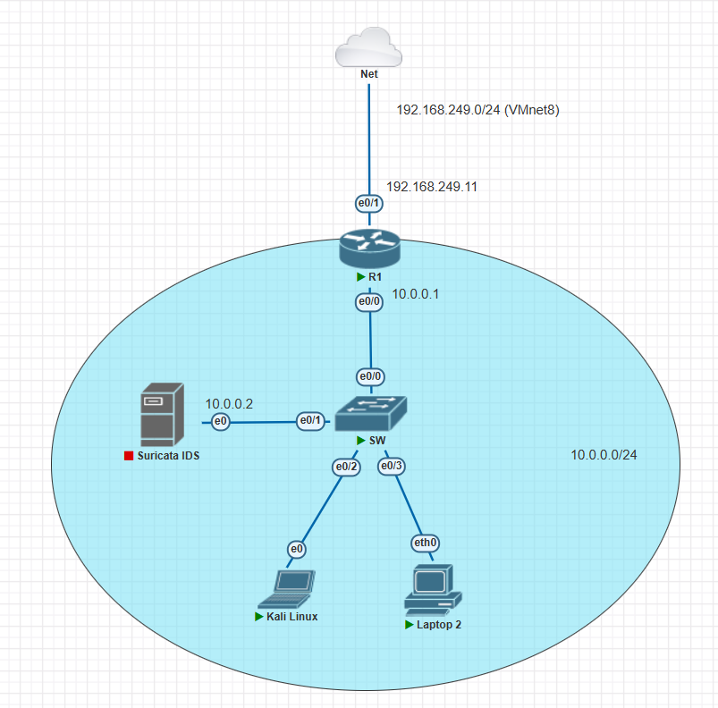

Here is the network diagram for the lab environment:



Devices with IP address notes on their interfaces will use that static IP address. The devices without IP address notes will use DHCP to get their IP address.

Double click on devices to open the console for configuring them. With network devices, virtual PC object, the Putty console will be opened. With the virtual Linux machine, QEMU will be opened to display the GUI.

## Config the router

```shell
enable   # Change to Privileged EXEC mode, the prompt will change from > to #
configure terminal # Change to Global Config mode, the prompt will change from # to (config)#
no ip domain-lookup # Disable DNS lookup, so that the router won't try to resolve any unknown command to an IP address
interface e0/1 # Change to Interface configuration mode, the prompt will change from (config)# to (config-if)#
ip address 192.168.249.11 255.255.255.0 # Assign IP address to the interface connected to WAN
ip nat outside # Set the interface as outside interface for NAT
no shutdown # Enable the interface, by default the interface is shutdown
ip route 0.0.0.0 0.0.0.0 192.168.249.2 # Set a default route to the WAN gateway, see the NAT gateway address in Vmware network settings
interface e0/0 # Change to config the LAN interface
ip address 10.0.0.1 255.255.255.0 # Assign IP address to the LAN interface
exitip nat inside # Set the interface as inside interface for NAT
no shutdown 
exit # Change back to global config mode, prompt will change from (config-if)# to (config)#
ip dhcp excluded-address 10.0.0.1 10.0.0.9 # Exclude IP addresses from .1 to .9 from DHCP pool
ip dhcp pool LAN # Create a DHCP pool named LAN, prompt will change from (config)# to (config-dhcp)#
network 10.0.0.0 255.255.255.0 # Define the network for the DHCP pool
default-router 10.0.0.1 # Set the default gateway, this ip the address of interface e0/0
dns-server 8.8.8.8 # Set the DNS server as Google DNS
exit # Change back to global config mode, prompt will change from (config-dhcp)# to (config)#
access-list 1 permit 10.0.0.0 0.0.0.255 # Create an access list with id 1, permit all IP addresses in the range
ip nat inside source list 1 interface e0/1 overload # Enable NAT, so that devices inside the lab can access the internet
end # Change back to Privileged EXEC mode, prompt will change from (config-dhcp)# to #
write memory # Save the configuration to the startup-config file, so that it will be loaded when the router reboots
```

I want to explain more about the NAT configuration on the router. The command:

```shell
access-list 1 permit 10.0.0.0 0.0.0.255 
ip nat inside source list 1 interface e0/1 overload
```

- The command `1 permit 10.0.0.0 0.0.0.255` creates an access list with id 1 that matches all IP addresses. In this lab, it allows all traffic from the LAN 10.0.0.0/24.

- The command `ip nat inside source list 1 interface e0/1 overload` enables **NAT Overloading (PAT - Port Address Translation)**. It translates all internal IPs from the access list to the IP address of the interface e0/1. So in our case, all IP addresses of machines inside LAN like Suricata IDS, Kali Linux, PC IP will be translated to a single IP address 192.168.249.11 (but with different port numbers). Ans since the IP address 192.168.249.11 belongs to VMnet8 (NAT), it will can access to the internet, and as a sequence, all devices inside LAN 10.0.0.0/24 can access the internet.

That is enough for the scope of the lab, but in case you wonder further even how the NAT in VMnet8 works "physically" to give the Internet access to the devices inside the lab, the full chain is as follows:

```plaintext
1. Lab Devices in LAN 10.0.0.0/24 (e.g., 10.0.0.2, 10.0.0.3)
↓
2. NAT Overloading by Cisco Router R1
→ Translates to: 192.168.249.11 (interface e0/1)
↓
3. VMnet8 (NAT) in VMware
→ NATs 192.168.249.11 and other virtual machines that you run in VMware application to the host machine's local IP (e.g., 192.168.1.130)
↓
4. Physical Home Router
→ The IP address of the physical host machine is still a private IP address, it then needs to be NATed by the physical router/modem in your room to a public IP address provided by your ISP that can be accessed by the internet, e.g., 210.86.228.177
```

In case you do not config the NAT overloading, the devices inside the lab can access the internet, but the internet cannot access the devices inside the lab. This is a good practice for security reasons.

## Config the PC

With the Virtual PC, type:

```shell
dhcp # Get IP address from the DHCP server, the router in this case
show ip # Show the IP address assigned to the PC
ping 10.0.0.1 -c 2 # Ping the router to check if the connection is ok
ping google.com -c 2 # Ping google.com to check if the internet connection is ok
```

Sample output:

```plaintext
VPCS> dhcp
DDORA IP 10.0.0.10/24 GW 10.0.0.1
VPCS> show ip

NAME        : VPCS[1]
IP/MASK     : 10.0.0.10/24
GATEWAY     : 10.0.0.1
DNS         : 8.8.8.8
DHCP SERVER : 10.0.0.1
DHCP LEASE  : 86161, 86400/43200/75600
MAC         : 00:50:79:66:68:05
LPORT       : 20000
RHOST:PORT  : 127.0.0.1:30000
MTU         : 1500

VPCS> ping 10.0.0.1 -c 2

84 bytes from 10.0.0.1 icmp_seq=1 ttl=255 time=2.578 ms
84 bytes from 10.0.0.1 icmp_seq=2 ttl=255 time=3.878 ms

VPCS> ping hust.com
hust.com resolved to 185.230.63.186

84 bytes from 185.230.63.186 icmp_seq=1 ttl=127 time=211.133 ms
84 bytes from 185.230.63.186 icmp_seq=2 ttl=127 time=210.514 ms
84 bytes from 185.230.63.186 icmp_seq=3 ttl=127 time=211.735 ms
84 bytes from 185.230.63.186 icmp_seq=4 ttl=127 time=209.452 ms
84 bytes from 185.230.63.186 icmp_seq=5 ttl=127 time=212.176 ms
```
With Kali Linux, open the terminal and type:

```shell
ip a # Show the IP address assigned to the PC, no need to request IP address from DHCP server, Kali auto do it before
ping 10.0.0.1 # Ping the router to check if the connection is ok
ping 10.0.0.10 # Ping the virtual PC to check if the connection is ok
ping google.com # Ping google.com to check if the internet connection is ok
```

With the Ubuntu serve, config the static IP address as 10.0.0.2, you can refer to [this](../Appendix/)

With this way, devices inside the Lab can talk to each other, and they can also access the internet, but devices outside the Lab cannot access devices inside the Lab.

Them sstatic Ip address cho Ubuntu server

Ket noi den card bridge voi mot cloud khac


Add command no tansalte
