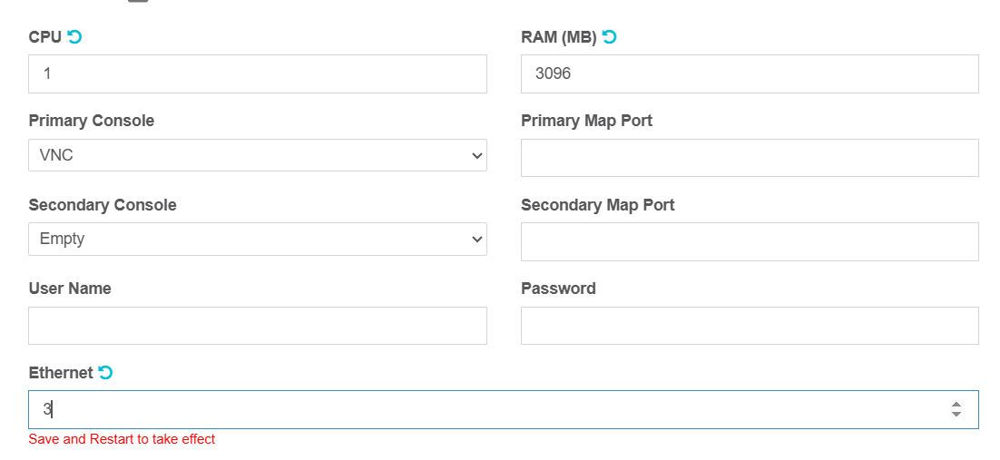
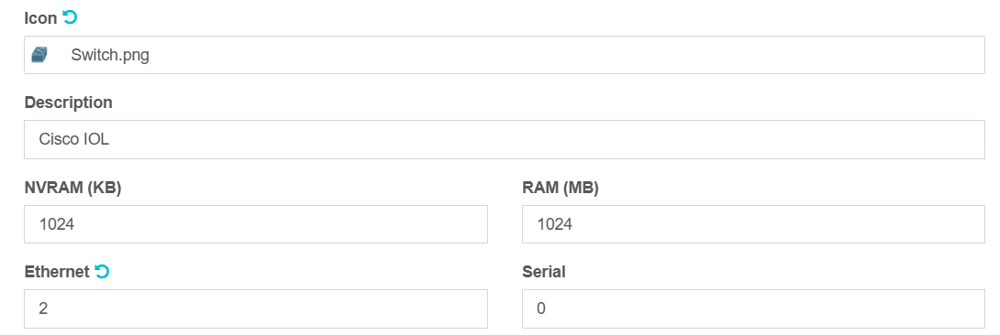
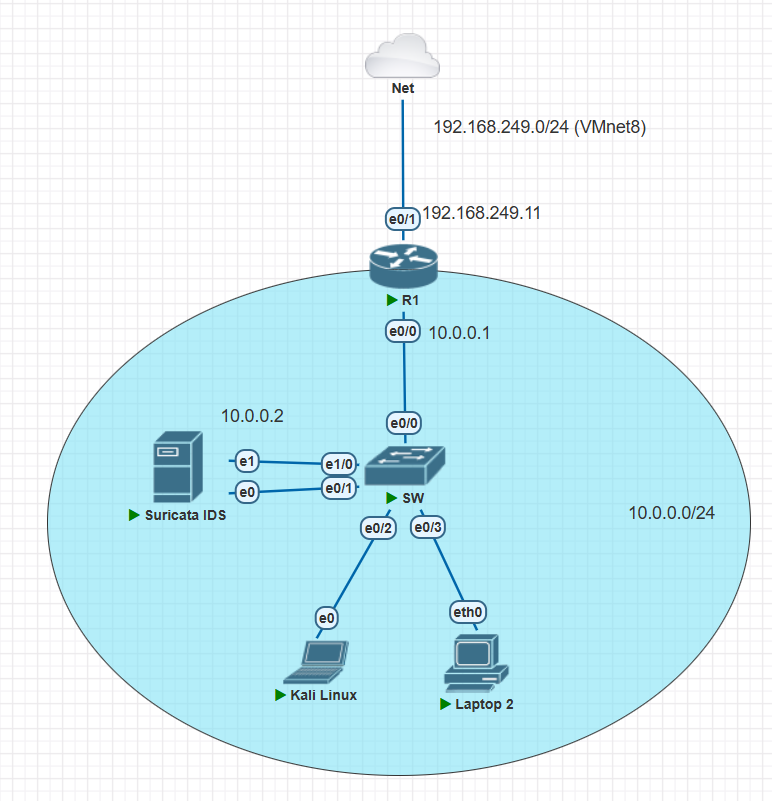
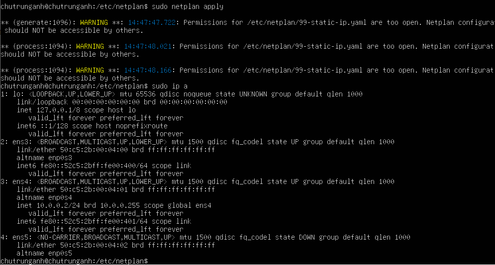

Here is the network diagram for the lab environment we are setting up (Temporary):


Devices with IP address notes on their interfaces will use that static IP address. The devices without IP address notes will use DHCP to get their IP address.

Double click on devices to open the console for configuring them. With network devices, virtual PC object, the Putty console will be opened. With the virtual Linux machine, QEMU will be opened to display the GUI.

## Config the router

Wait a few seconds after click `Start` button to let the router boot up. Then, open the console and type:

```shell
enable   # Change to Privileged EXEC mode, the prompt will change from > to #
configure terminal # Change to Global Config mode, the prompt will change from # to (config)#
no ip domain-lookup # Disable DNS lookup, so that the router won't try to resolve any unknown command to an IP address
interface e0/1 # Change to Interface configuration mode, the prompt will change from (config)# to (config-if)#
ip address 192.168.249.11 255.255.255.0 # Assign IP address to the interface connected to WAN
ip nat outside # Set the interface as outside interface for NAT
no shutdown # Enable the interface, by default the interface is shutdown
ip route 0.0.0.0 0.0.0.0 192.168.249.2 # Set a default route to the WAN gateway, see the NAT gateway address in Vmware network settings
interface e0/0 # Change to config the LAN interface
ip address 10.0.0.1 255.255.255.0 # Assign IP address to the LAN interface
ip nat inside # Set the interface as inside interface for NAT
no shutdown 
exit # Change back to global config mode, prompt will change from (config-if)# to (config)#
ip dhcp excluded-address 10.0.0.1 10.0.0.9 # Exclude IP addresses from .1 to .9 from DHCP pool
ip dhcp pool LAN # Create a DHCP pool named LAN, prompt will change from (config)# to (config-dhcp)#
network 10.0.0.0 255.255.255.0 # Define the network for the DHCP pool
default-router 10.0.0.1 # Set the default gateway, this ip the address of interface e0/0
dns-server 8.8.8.8 # Set the DNS server as Google DNS
exit # Change back to global config mode, prompt will change from (config-dhcp)# to (config)#
access-list 1 permit 10.0.0.0 0.0.0.255 # Create an access list with id 1, permit all IP addresses in the range
ip nat inside source list 1 interface e0/1 overload # Enable NAT, so that devices inside the lab can access the internet
ip nat inside source static tcp 10.0.0.2 22 192.168.249.11 2222 # Enable port forwarding, I will explain in detail later
ip nat inside source static tcp 10.0.0.3 5601 192.168.249.11 3333 # PLACEHOLDER
ip nat inside source static tcp 10.0.0.4 80 192.168.249.11 4444 # PLACEHOLDER
end # Change back to Privileged EXEC mode, prompt will change from (config-dhcp)# to #
write memory # Save the configuration to the startup-config file, so that it will be loaded when the router reboots
```

I want to explain more about the NAT configuration on the router. The command:

```shell
access-list 1 permit 10.0.0.0 0.0.0.255 
ip nat inside source list 1 interface e0/1 overload
```

- The command `1 permit 10.0.0.0 0.0.0.255` creates an access list with id 1 that matches all IP addresses. In this lab, it allows all traffic from the LAN 10.0.0.0/24.

- The command `ip nat inside source list 1 interface e0/1 overload` enables **NAT Overloading (PAT - Port Address Translation)**. It translates all internal IPs from the access list to the IP address of the interface e0/1. So in our case, all IP addresses of machines inside LAN like Suricata IDS, Kali Linux, PC IP will be translated to a single IP address 192.168.249.11 (but with different port numbers). And since the IP address 192.168.249.11 belongs to VMnet8 (NAT), it will be able to access the internet, and as a result, all devices inside LAN 10.0.0.0/24 can access the internet.

That is enough for the scope of the lab, but in case you wonder further even how the NAT in VMnet8 works "physically" to give the Internet access to the devices inside the lab, the full chain is as follows:

```plaintext
1. Lab Devices in LAN 10.0.0.0/24 (e.g., 10.0.0.2, 10.0.0.3)
                               ↓
2. NAT Overloading by Cisco Router R1
→ Translates to: 192.168.249.11 (interface e0/1).
                               ↓
3. VMnet8 (NAT) in VMware
→ NATs 192.168.249.11 and other virtual machines that you run in VMware application to the host machine's local IP (e.g., 192.168.1.130). 
                               ↓
4. Physical Home Router
→ The IP address of the physical host machine is still a private IP address, it then needs to be NATed by the physical router/modem in your room to a public IP address provided by your ISP that can be accessed by the internet, e.g., 210.86.228.177
```

*In case you do not config the NAT overloading, the devices inside the lab may still access the internet since some router models by default have the NAT overloading enabled.*


By using NAT overload, all devices inside the lab’s LAN 10.0.0.0/24 can access the Internet. However, devices outside the lab, like your physical host machine, cannot directly reach the lab's internal devices — because those use private IP addresses, which are not routable from outside. This setup is secure and reflects how real-world networks usually work.

However, in this lab I still want to SSH to the Suricata IDS to config it from my physical host machine (Config Suricata IDS right from PnetLab QEMU is possible but it does not share clipboard with host machine, so I can not copy/paste text to write my report). Therefore, I will config the port forwarding for SSH connection to Suricata IDS from my host machine. I already config this port forwarding when config the router in the command:

```shell
ip nat inside source static tcp 10.0.0.2 22 192.168.249.11 2222
```
What this does -> When there is access to 192.168.249.11 port 2222 → router will forward it to 10.0.0.2 port 22 (Suricata IDS SSH port). Since 192.168.249.11 is an IP address of the VMnet8 NAT interface, it is reachable from the physical host machine. So I can SSH to Suricata IDS from my host machine by the command:

<a id="ssh-to-suricata-ids"></a>

```shell
ssh chutrunganh@192.168.249.11 -p 2222
```
*Replace chutrunganh with your Suricata IDS username (not the PNetLab one), the IP address of remote machine is now the IP on router WAN interface, and the port is 2222 (the port we config for NAT port forwarding).*

You can check your current NAT forwarding by:

```shell
enable
show running-config | include nat
```

Sample output:

```plaintext
Router#enable
Router#show running-config | include nat
 ip nat inside
 ip nat outside
ip nat inside source list 1 interface Ethernet0/1 overload
ip nat inside source static tcp 10.0.0.2 22 192.168.249.11 2222 extendable
ip nat inside source static tcp 10.0.0.3 5601 192.168.249.11 3333 extendable
ip nat inside source static tcp 10.0.0.4 80 192.168.249.11 4444 extendable
```


**If the Suricata IDS hasn't been assigned a static IP address yet, skip this for now, until you do  [ steps below to config the Ubuntu server](#ubuntu-server-static-ip-config), then come back to this step to perform the SSH connection again.**


Sample output:

```plaintext
C:\Users\Chu Trung Anh>ssh chutrunganh@192.168.249.11 -p 2222
chutrunganh@192.168.249.11's password:
Welcome to Ubuntu 24.04.2 LTS (GNU/Linux 6.8.0-57-generic x86_64)
......
chutrunganh@chutrunganh:~$ ip a
1: lo: <LOOPBACK,UP,LOWER_UP> mtu 65536 qdisc noqueue state UNKNOWN group default qlen 1000
    link/loopback 00:00:00:00:00:00 brd 00:00:00:00:00:00
    inet 127.0.0.1/8 scope host lo
       valid_lft forever preferred_lft forever
    inet6 ::1/128 scope host noprefixroute
       valid_lft forever preferred_lft forever
2: ens3: <BROADCAST,MULTICAST,UP,LOWER_UP> mtu 1500 qdisc fq_codel state UP group default qlen 1000
    link/ether 50:98:1d:00:04:00 brd ff:ff:ff:ff:ff:ff
    altname enp0s3
    inet 10.0.0.2/24 brd 10.0.0.255 scope global ens3
       valid_lft forever preferred_lft forever
    inet6 fe80::5298:1dff:fe00:400/64 scope link
       valid_lft forever preferred_lft forever
chutrunganh@chutrunganh:~$
```
SSH to Suricata IDs inside PnetLab's LAN from physical host machine successfully. 

## Config the PC

- **With the Virtual PC**

Type:

```shell
dhcp # Get IP address from the DHCP server, the router in this case
show ip # Show the IP address assigned to the PC
ping 10.0.0.1 -c 2 # Ping the router to check if the connection is ok
ping google.com -c 2 # Ping google.com to check if the internet connection is ok
```

Sample output:

```plaintext
VPCS> dhcp
DDORA IP 10.0.0.10/24 GW 10.0.0.1
VPCS> show ip

NAME        : VPCS[1]
IP/MASK     : 10.0.0.10/24
GATEWAY     : 10.0.0.1
DNS         : 8.8.8.8
DHCP SERVER : 10.0.0.1
DHCP LEASE  : 86161, 86400/43200/75600
MAC         : 00:50:79:66:68:05
LPORT       : 20000
RHOST:PORT  : 127.0.0.1:30000
MTU         : 1500

VPCS> ping 10.0.0.1 -c 2

84 bytes from 10.0.0.1 icmp_seq=1 ttl=255 time=2.578 ms
84 bytes from 10.0.0.1 icmp_seq=2 ttl=255 time=3.878 ms

VPCS> ping hust.com
hust.com resolved to 185.230.63.186

84 bytes from 185.230.63.186 icmp_seq=1 ttl=127 time=211.133 ms
84 bytes from 185.230.63.186 icmp_seq=2 ttl=127 time=210.514 ms
84 bytes from 185.230.63.186 icmp_seq=3 ttl=127 time=211.735 ms
84 bytes from 185.230.63.186 icmp_seq=4 ttl=127 time=209.452 ms
84 bytes from 185.230.63.186 icmp_seq=5 ttl=127 time=212.176 ms
```
- **With Kali Linux**

Open the terminal and type:

```shell
ip a # Show the IP address assigned to the PC, no need to request IP address from DHCP server, Kali auto do it before
ping 10.0.0.1 # Ping the router to check if the connection is ok
ping 10.0.0.10 # Ping the virtual PC to check if the connection is ok
ping google.com # Ping google.com to check if the internet connection is ok
```

<a id="ubuntu-server-static-ip-config"></a>

- **With the Ubuntu server**

Config the static IP address as 10.0.0.2/24, gateway as 10.0.0.1. You can refer to [this](../Appendix/Setup%20static%20IP%20on%20Ubuntu%20Server.md)

After config the static IP address, try to SSH to this from your physical host machine as I [mentioned](#ssh-to-suricata-ids).

## Config the Switch

Normally, if we just create and connect switch to devices without any config, it only sends traffic to the specific destination MAC. This is normal behavior of a switch. However, by this, an IDS would miss most of the traffic unless it’s directly involved. In practical scenarios, switches often have a port mirroring (SPAN) feature to send all traffic to a specific port. In this lab, I will config the switch to send all traffic to the port connected to Suricata IDS. This is called **Port Mirroring**.

*Port Mirroring (SPAN) is a switch feature that copies all traffic (inbound and/or outbound) from one or more source ports (or VLANs), and sends it to a specific destination port — where you usually place a packet analyzer like Suricata, Wireshark, or Snort.*

```shell
enable # Change to Privileged EXEC mode, the prompt will change from > to #
configure terminal # Change to Global Config mode, the prompt will change from # to (config)#
no ip domain-lookup # Disable DNS lookup, so that the switch won't try to resolve any unknown command to an IP address

monitor session 1 source interface e0/2 both # Set the source port to e0/2, which is connected to Kali Linux, both will copy both inbound and outbound traffic on this port
monitor session 1 source interface e0/3 both # Set the source port to e0/3, which is connected to the virtual PC, both will copy both inbound and outbound traffic on this port
monitor session 1 destination interface e0/1 # Set the destination port to e0/1, where the Suricata IDS is connected
end
write memory # Save the configuration
```

However, after config this, we can not SSH to the Suricata IDS anymore. This is because when using SPAN/Port Mirroring, the IDS’s interface used to receive mirrored traffic becomes read-only (it passively listens, but cannot send replies — so no SSH, ping, etc.). The solution is to create add a new interface to the Suricata IDS just for SSH connection. This interface will be connected to the switch, and it will not be in the SPAN session. So we can SSH to this interface, and the Suricata IDS can still receive mirrored traffic from the switch.


Turn off the Suricata IDS and add a new interface to it by right click -> `Edit` -> change `Ethernet` to 3



We now  have three interfaces on the Suricata IDS:

- **eth0**: Sniffer interface, receive mirrored traffic from the switch, read-only, no IP address assigned to it. This will help IDS work in "stealth mode", so that it can monitor the network without being detected.

- **eth1**: Management interface, used for SSH connection, assigned with static IP address 10.0.0.2/24
- **eth2**: Logging/Alerting interface, used for logging and alerting, assigned with static IP address (Currently not config yet, I will config it later in the lab). This interface will later be connected to a machine running ELK stack for logging and alerting. 

The switch also needs to add more interfaces, shut down the switch, change `Ethernet` to 2, which means the switch now has 8 interfaces. 



Then, we need to reconfigure the switch and Suricata IDS machine for this new network topology.



### Reconfig the Suricata IDS

Open the console of the Suricata IDS and type:

```shell
ip a
```
This shows the actual name of the interface on your devices, in my case, there are three interfaces: ens3, ens4, ens5 (The name of the interface may be different on your devices), the `ens3` will correspond to the `eth0` interface, `ens4` will correspond to the `eth1` interface, and `ens5` will correspond to the `eth2` interface. Remember the name of the interface.

Then type:

```shell
cd /etc/netplan/ # Change to the network config directory
ls # List the files in this directory
sudo nano <yaml_file_you_see_from_ls_command_with_biggest_number> 
```

Then add these settings to the file (indent using 2 spaces, not tabs, and make sure the indentation is correct):

```yaml
network:
  version: 2
  ethernets:
    # ens3 = eth0, the interface connected to the switch SPAN port
    ens3:
      dhcp4: no
    # ens4 = eth1, the management interface, used for SSH connection
    ens4:
      dhcp4: no
      addresses: [10.0.0.2/24]
      routes:
        - to: default
          via: 10.0.0.1
      nameservers:
        addresses: [8.8.8.8, 1.1.1.1]
    # ens5 = eth2, the interface connected to the ELK machine
    ens5:
      dhcp4: no
      # Config IP address later, when we have the ELK machine
```

Then press `Ctrl + O` to save the file, and `Ctrl + X` to exit the editor. 

After that, type:

```shell
sudo netplan apply # Apply the new network settings
ip a # Show the IP address assigned to the interfaces
```

Sample output:



In my case, the interface ens4 is assigned with IP address

### Reconfig the Switch

Open the console of the switch and type:

```shell
enable 
configure terminal
no monitor session 1 # Remove the old SPAN session
monitor session 1 source interface e0/2 both # Set the source port to e0/2, which is connected to Kali Linux, both will copy both inbound and outbound traffic on this port
monitor session 1 source interface e0/3 both # Set the source port to e0/3, which is connected to the virtual PC
monitor session 1 destination interface e0/1 # Set the destination port to e0/1, where the Suricata IDS is connected to
end
write memory # Save the configuration
```

**Shut down** the **Switch**, **Router** and reopen them to apply the new configuration. 

Check the SSH connection to the Suricata IDS again from your physical host machine:

```plaintext
C:\Users\Chu Trung Anh>ssh chutrunganh@192.168.249.11 -p 2222
chutrunganh@192.168.249.11's password:
Welcome to Ubuntu 24.04.2 LTS (GNU/Linux 6.8.0-57-generic x86_64)
...
chutrunganh@chutrunganh:~$ ip a
1: lo: <LOOPBACK,UP,LOWER_UP> mtu 65536 qdisc noqueue state UNKNOWN group default qlen 1000
    link/loopback 00:00:00:00:00:00 brd 00:00:00:00:00:00
    inet 127.0.0.1/8 scope host lo
       valid_lft forever preferred_lft forever
    inet6 ::1/128 scope host noprefixroute
       valid_lft forever preferred_lft forever
2: ens3: <BROADCAST,MULTICAST,UP,LOWER_UP> mtu 1500 qdisc fq_codel state UP group default qlen 1000
    link/ether 50:c5:2b:00:04:00 brd ff:ff:ff:ff:ff:ff
    altname enp0s3
    inet6 fe80::52c5:2bff:fe00:400/64 scope link
       valid_lft forever preferred_lft forever
3: ens4: <BROADCAST,MULTICAST,UP,LOWER_UP> mtu 1500 qdisc fq_codel state UP group default qlen 1000
    link/ether 50:c5:2b:00:04:01 brd ff:ff:ff:ff:ff:ff
    altname enp0s4
    inet 10.0.0.2/24 brd 10.0.0.255 scope global ens4
       valid_lft forever preferred_lft forever
    inet6 fe80::52c5:2bff:fe00:401/64 scope link
       valid_lft forever preferred_lft forever
4: ens5: <NO-CARRIER,BROADCAST,MULTICAST,UP> mtu 1500 qdisc fq_codel state DOWN group default qlen 1000
    link/ether 50:c5:2b:00:04:02 brd ff:ff:ff:ff:ff:ff
    altname enp0s5
```
*SSH connection to Suricata IDS is successful*

### Test the Port Mirroring

To test if our port mirroring is working, conduct a small test as follows:

From the Suricata IDS, run tcpdump command to capture the traffic on the interface ens3 (the interface connected to the switch SPAN port):

```shell
sudo tcpdump -i ens3 
```

1. **From Virtual PC ping to the Kali Linux machine:**

```shell
ping 10.0.0.11 -c 2
``` 

*Check if the Virtual PC has an IP address yet, if not, use `dhcp` command to get IP address from the DHCP server (the router in this case) before performing the ping command. Every time you restart the PnetLab VM, the IP address of Virtual PC may be removed and require running `dhcp` command again.*

This ping command is only sent between the Virtual PC and Kali Linux machine, and not to the Suricata IDS. However, you can see the traffic on the Suricata IDS console. This is because the switch is sending all traffic to the Suricata IDS interface ens3 (the interface connected to the switch SPAN port).

Sample output on the Suricata IDS console:

```plaintext
chutrunganh@chutrunganh:~$ sudo tcpdump -i ens3
tcpdump: verbose output suppressed, use -v[v]... for full protocol decode
listening on ens3, link-type EN10MB (Ethernet), snapshot length 262144 bytes
16:10:48.358674 IP 10.0.0.10 > 10.0.0.11: ICMP echo request, id 62073, seq 1, length 64
16:10:48.358675 IP 10.0.0.10 > 10.0.0.11: ICMP echo request, id 62073, seq 1, length 64
16:10:48.361656 IP 10.0.0.11 > 10.0.0.10: ICMP echo reply, id 62073, seq 1, length 64
16:10:48.361657 IP 10.0.0.11 > 10.0.0.10: ICMP echo reply, id 62073, seq 1, length 64
```
*The IDS can see traffic that is not intended for it, thanks to the switch SPAN port.*

2. **From Virtual PC ping to the internet:**

```shell
ping google.com -c 2
```

Sample output on the Suricata IDS console:

```plaintext
chutrunganh@chutrunganh:~$ sudo tcpdump -i ens3
[sudo] password for chutrunganh:
tcpdump: verbose output suppressed, use -v[v]... for full protocol decode
listening on ens3, link-type EN10MB (Ethernet), snapshot length 262144 bytes
03:05:00.883821 IP 10.0.0.11 > dns.google: ICMP echo request, id 56501, seq 1, length 64
03:05:00.913741 IP dns.google > 10.0.0.11: ICMP echo reply, id 56501, seq 1, length 64
03:05:01.916004 IP 10.0.0.11 > dns.google: ICMP echo request, id 56757, seq 2, length 64
03:05:01.946537 IP dns.google > 10.0.0.11: ICMP echo reply, id 56757, seq 2, length 64
```
*The IDS can see traffic that is not intended for it, thanks to the switch SPAN port.*

