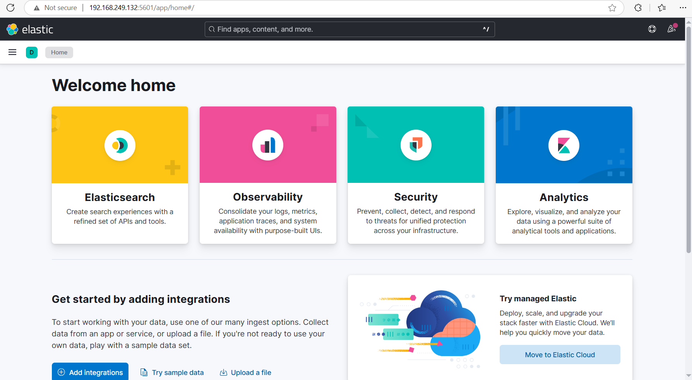

Remember to add
Choose ubuntu minimal

sudo apt install iputils-ping nano 

do minmal khong co
Nho install ngay khi con o trong VMware vi khi sang pnetlab chua co mang khi chua config duoc switch

``sudo install nano -y```

Ctr W to find

After install kibana, wiat for few min then access the Web



[Suricata Server] --(Filebeat sends logs)--> [Logstash on ELK Server] --> [Elasticsearch] --> [Kibana]


filebeat.inputs:
- type: log
  enabled: true
  paths:
    - /var/log/suricata/eve.json
  json.keys_under_root: true
  json.add_error_key: true

output.logstash:
  hosts: ["<Địa_chỉ_IP_ELK>:5044"]


 The common ways are Filebeat with the Suricata module, or pure logstash. While these store events in Elasticsearch differently, Kibana should still be able to discover them.

 Just direclty use fielkbeat: https://discuss.elastic.co/t/dashboards-for-suricata-filebeat-logstash-setup/372436/2

 Config ELK with Suricata Eng: https://www.digitalocean.com/community/tutorials/how-to-build-a-siem-with-suricata-and-elastic-stack-on-ubuntu-20-04

 https://www.criticaldesign.net/post/how-to-setup-a-suricata-ips-elk-stack

 Viet:

 https://123host.vn/community/tutorial/huong-dan-cai-dat-siem-dung-suricata-va-elastic-stack-tren-ubuntu-2004.html


Cai dat Suricata:

Eng: https://suricata.readthedocs.io/en/suricata-6.0.0/guide/install.html; https://www.criticaldesign.net/post/how-to-setup-a-suricata-ips

Viet: https://adminvietnam.org/he-thong-ids-ips-cai-dat-va-cau-hinh-suricata/4801/


Bước 2: Kích hoạt Suricata module trong Filebeat
Chạy lệnh sau:

bash
Copy
Edit
sudo filebeat modules enable suricata
Sau đó chỉnh sửa file module nếu cần:

bash
Copy
Edit
sudo nano /etc/filebeat/modules.d/suricata.yml
Đảm bảo dòng sau được bật:

yaml
Copy
Edit
- module: suricata
  eve:
    enabled: true
    var.paths:
      - /var/log/suricata/eve.json
✅ Mẹo: dùng filebeat modules list để kiểm tra suricata đã bật chưa.


# Install DvWa

Read in link  Vietnamese: https://vietnix.vn/cai-dat-dvwa-tren-linux/


