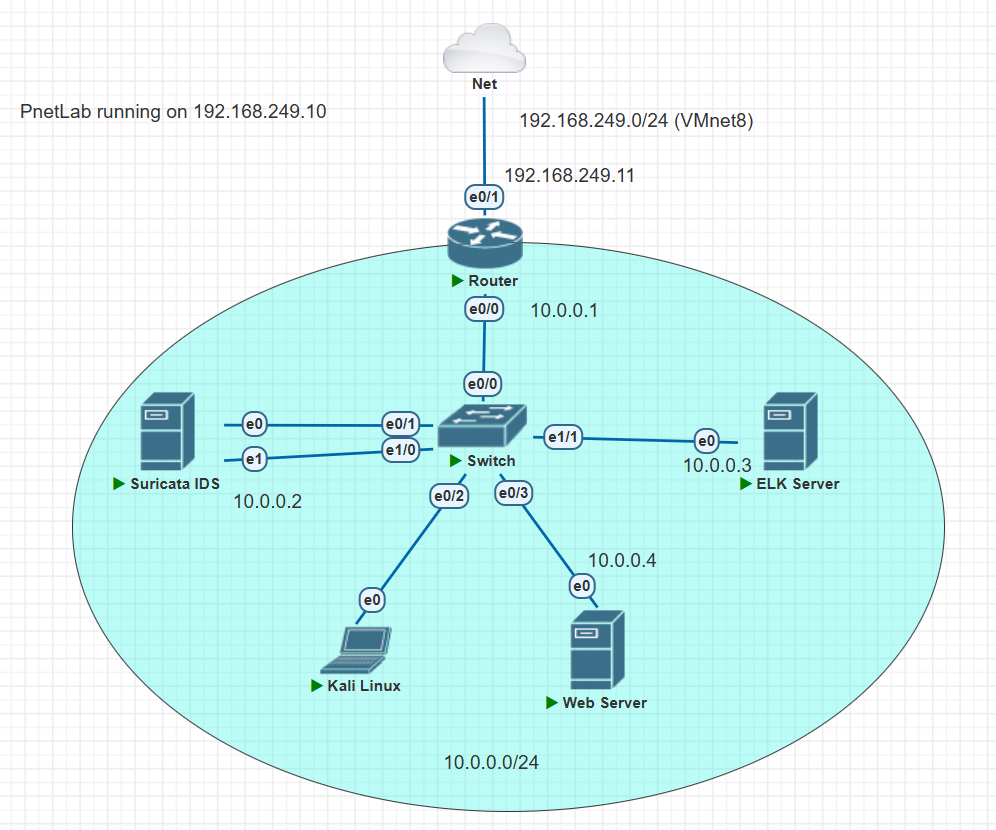
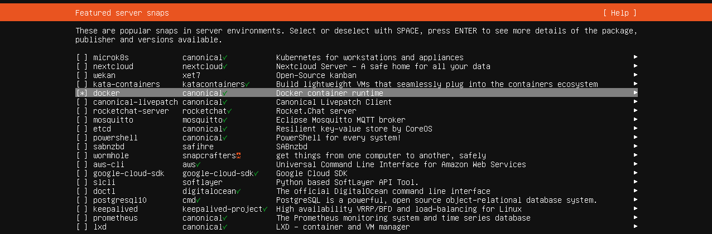
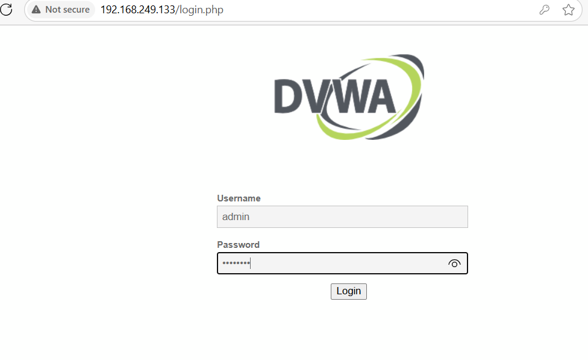
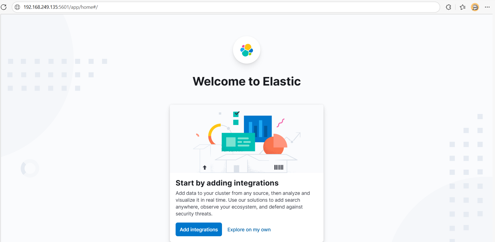
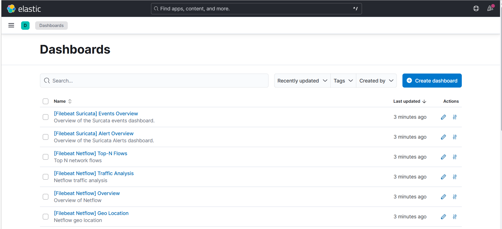
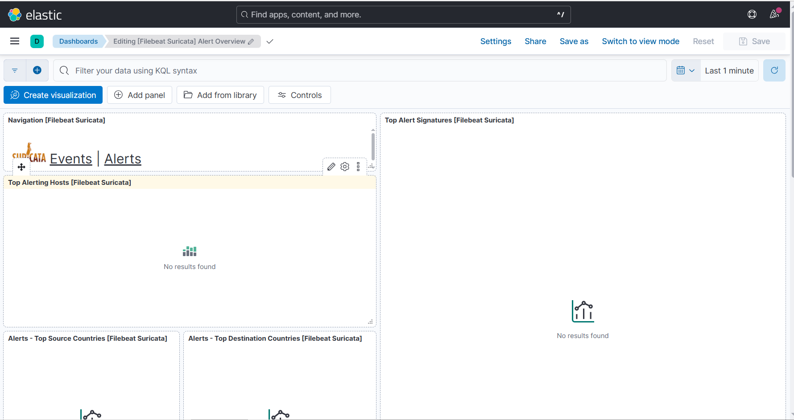
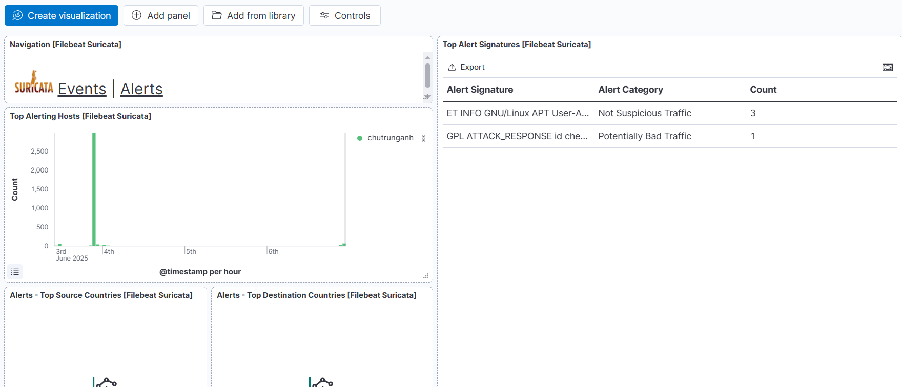

In this section, we will update the network to be more realistic by adding:

- An ELK server to collect and visualize logs from Suricata.
- A target DVWA webserver to test attacks.



# Install and setup DVWA webserver

In the VMware, create a new VM to install the DVWA webserver. You can use the same Ubuntu Server `iso` file as we did with the Suricata machine. The setup is similar to the Suricata machine, except for the last step where you need to choose additional packages to install Docker since we plan to run DVWA in a Docker container.




After the installation is complete, run the following commands to install Docker and run the DVWA container:

```bash
sudo docker run -d -p 80:80 vulnerables/web-dvwa
```
Then open the web browser on host machine, then access the DVWA webserver using the IP address of the VM. For example, if my VM's IP address is `192.168.249.133`:



Login with default credentials as `admin` and `password`.

Now we verify that the dvwa webserver is successfully installed. Let's change the IP address of this VM to match the IP address in the network diagram before packaging it for Pnetlab.

```bash
sudo apt update
sudo apt install iputils-ping nano -y #After change the IP, we will not have the Internet connection until we run this successfully in the Pnetlab, so before that, to configure it in Pnetlab, install nano and ping first.
sudo nano /etc/netplan/99-static-ip.yaml
```

Then use the following content to configure the static IP address for this VM:
```yaml
network:
  version: 2
  ethernets:
    # ens3 = eth0, webserver only have this interface
    ens3:
      dhcp4: no # Disable DHCP for this interface since we want to use a static IP
      addresses: [10.0.0.4/24]
      routes:
        - to: default
          via: 10.0.0.1 # Router IP address
      nameservers:
        addresses: [8.8.8.8, 1.1.1.1]
```

Then save the file and apply the changes:

```bash
sudo netplan apply
```

> [!NOTE]
> If you run `ip a` right now, you will still see the old IP of interface `ens33`, this is normal behavior, since the interface `ens3` is not available yet. Only after you export and run this VM inside the Pnetlab, the interface `ens3` will be available and the IP address will be changed as configured above.

# Install and setup ELK server

Create a Ubuntu Server VM in VMware, choose the same Ubuntu Server `iso` file as we did with the Suricata machine. After created, SSH from host to this VM, then run the following commands:

```bash
sudo apt update
sudo apt install nano iputils-ping -y
curl -fsSL https://artifacts.elastic.co/GPG-KEY-elasticsearch | sudo gpg --dearmor -o /usr/share/keyrings/elastic.gpg # Add the GPG key for the Elastic repository
echo "deb [signed-by=/usr/share/keyrings/elastic.gpg] https://artifacts.elastic.co/packages/8.x/apt stable main" | sudo tee /etc/apt/sources.list.d/elastic-8.x.list
sudo apt update
sudo apt install elasticsearch
sudo systemctl enable elasticsearch
sudo systemctl start elasticsearch
sudo systemctl status elasticsearch # Make sure Elasticsearch is running
```

Then we need to allow connection to Elasticsearch from other machines (by default it only allows connection on localhost), so we need to edit the configuration file, uncommand this line:

```bash
sudo nano /etc/elasticsearch/elasticsearch.yml
```

Uncomment the line `network.host` and set it to `0.0.0.0`:

```yaml
# ---------------------------------- Network -----------------------------------
#
# By default Elasticsearch is only accessible on localhost. Set a different
# address here to expose this node on the network:
#
network.host: 0.0.0.0
```
This will allow Elasticsearch to listen on all network interfaces, making it accessible from other machines in the network. Also, for simplicity, we will disable the security features of Elasticsearch for now, so we can access it without authentication. Set following lines to `false`:

```yaml
# Enable security features
xpack.security.enabled: false

xpack.security.enrollment.enabled: false

# Enable encryption for HTTP API client connections, such as Kibana, Logstash, and Agents
xpack.security.http.ssl:
  enabled: false
  keystore.path: certs/http.p12

# Enable encryption and mutual authentication between cluster nodes
xpack.security.transport.ssl:
  enabled: false
  verification_mode: certificate
```

Then restart the Elasticsearch service:

```bash
sudo systemctl restart elasticsearch
sudo systemctl restart elasticsearch.service
systemctl daemon-reload
```
Then try a test HTTP request to the Elasticsearch server to verify that it is running and accessible. You can use `curl` command from the terminal:

```plaintext
chutrunganh@elk:~$ curl -X GET http://192.168.249.135:9200
```

Replace with the IP address of your ELK server. You should see a JSON response with information about the Elasticsearch node.


Expected output:

```json
{
  "name" : "elk",
  "cluster_name" : "elasticsearch",
  "cluster_uuid" : "RN5l5hQqRsSM9o-FcmfPkQ",
  "version" : {
    "number" : "8.18.2",
    "build_flavor" : "default",
    "build_type" : "deb",
    "build_hash" : "c6b8d8d951c631db715485edc1a74190cdce4189",
    "build_date" : "2025-05-23T10:07:06.210694702Z",
    "build_snapshot" : false,
    "lucene_version" : "9.12.1",
    "minimum_wire_compatibility_version" : "7.17.0",
    "minimum_index_compatibility_version" : "7.0.0"
  },
  "tagline" : "You Know, for Search"
}
```

# Install and setup Kibana

On the same terminal that is connected to the ELK server, run the following commands to install Kibana (Elasticsearch and Kibana will run on the same server, in this lab we do not need to use Logstash):

```bash
sudo apt update
sudo apt install kibana
sudo systemctl enable kibana
sudo systemctl start kibana
sudo systemctl status kibana # Make sure Kibana is running
```

Then we need to allow connection to Kibana from other machines (by default it only allows connection on localhost), so we need to edit the configuration file, uncommand this line:

Run:

```bash
sudo nano /etc/kibana/kibana.yml
```
Uncomment the line `server.host` and set it to `0.0.0.0`:

```yaml
# =================== System: Kibana Server ===================
# Kibana is served by a back end server. This setting specifies the port to use.
#server.port: 5601
# Specifies the address to which the Kibana server will bind. IP addresses and host names are both valid values.
# The default is 'localhost', which usually means remote machines will not be able to connect.
# To allow connections from remote users, set this parameter to a non-loopback address.
server.host: 0.0.0.0
```

Also uncomment the line `elasticsearch.hosts` and set it to the IP address of your ELK server:

```yaml
elasticsearch.hosts: ["http://192.168.249.135:9200"]
```
*Remember to change this to `10.0.0.3` later when deploying to Pnetlab, using multiple IPs here like ["IP1", "IP2"] can cause errors.*

Then restart the Kibana service:

```bash
sudo systemctl restart kibana
```

Then open web browser on host machine, and access Kibana using the IP address of the ELK server. For example, if my ELK server's IP address is `192.168.249.135`, enter that on the browser address bar `192.168.249.135:5601`:



> [!TIP]
> In case you can not access the Kibana web interface, you can check the Kibana logs for any errors by running the following command on the ELK server: `sudo journalctl -u kibana -f`.


# Install and setup Filebeat

The Elastic Stack uses lightweight data shippers called Beats to collect data from various sources and send it to Logstash or Elasticsearch. Below are the Beats currently available from Elastic:

- **Filebeat**: Collects and forwards log files.

- **Metricbeat**: Collects metrics from your systems and services.

- **Packetbeat**: Captures and analyzes network traffic data.

- **Winlogbeat**: Collects Windows event logs.

- **Auditbeat**: Collects Linux audit framework data and monitors file integrity.

- **Heartbeat**: Monitors service availability using active probing.

In our case, we will use **Filebeat** to collect logs from Suricata and send them to Elasticsearch for visualization in Kibana.

On the Suricata machine, we will install Filebeat to send logs to the ELK server. Run the following commands:

```bash
curl -fsSL https://artifacts.elastic.co/GPG-KEY-elasticsearch | sudo gpg --dearmor -o /usr/share/keyrings/elastic.gpg
echo "deb [signed-by=/usr/share/keyrings/elastic.gpg] https://artifacts.elastic.co/packages/8.x/apt stable main" | sudo tee /etc/apt/sources.list.d/elastic-8.x.list
sudo apt update
sudo apt install filebeat
sudo systemctl enable filebeat
sudo systemctl start filebeat
sudo systemctl status filebeat # Make sure Filebeat is running
```

Normally, the workflow of ELK will be as follows: Endpoint devices contains services + Beats installed to collect data of these services  to send to a different server. In this case, the manager server is the ELK server, which contains: Logstash (to process, normalize data/logs) -> Elasticsearch (to store data/logs) -> Kibana (to visualize data/logs). However, as discussed in [this](https://discuss.elastic.co/t/dashboards-for-suricata-filebeat-logstash-setup/372436), Filebeat now has the Suricata module, which helps it send the logs directly to Elasticsearch and Kibana without needing Logstash. 

```bash
sudo filebeat modules enable suricata
```

> [!TIP]
> Use command `sudo filebeat modules list` to check if the Suricata module is enabled.

Then open this file to config for the Suricata module:

```bash
sudo nano /etc/filebeat/modules.d/suricata.yml
```

Enter as follow:

```yaml
- module: suricata
  eve:
    enabled: true
    var.paths: ["/var/log/suricata/eve.json"]
```
This will tell Filebeat to collect logs from the Suricata's `eve.json` file, which is the detailed log file of Suricata, and send it to Elasticsearch.

Then we need to configure Filebeat to send logs to the ELK server. Open the main configuration file:

```bash
sudo nano /etc/filebeat/filebeat.yml
```

Change the IP of the ELK server in the `output.elasticsearch` section to match the IP address of your ELK server. Use the IP `10.0.0.3` as in the network diagram (Doing this then you can only test your ELK when finished setting and running the ELK server in Pnetlab) or use the current IP of ELK server on the VMware machine (doing this allows you to test your ELK right now):

```yaml
# ---------------------------- Elasticsearch Output ----------------------------
output.elasticsearch:
# Array of hosts to connect to.
hosts: ["http://192.168.249.135:9200"]
```

*Remember to change the IP address to `10.0.0.3` later when deploying to Pnetlab.*

Then check for the Kibana configuration section in the same file, enter IP of ELK server for `host`:

```yaml
# =================================== Kibana ===================================

# Starting with Beats version 6.0.0, the dashboards are loaded via the Kibana API.
# This requires a Kibana endpoint configuration.
setup.kibana:

  # Kibana Host
  # Scheme and port can be left out and will be set to the default (http and 5601)
  # In case you specify and additional path, the scheme is required: http://localhost:5601/path
  # IPv6 addresses should always be defined as: https://[2001:db8::1]:5601
  host:  192.168.249.135
```
*Remember to change the IP address to `10.0.0.3` later when deploying to Pnetlab.*

Also enable the `setup.dashboards.enabled` option as `true` to load the sample dashboards:

```yaml
# ================================= Dashboards =================================
# These settings control loading the sample dashboards to the Kibana index. Loading
# the dashboards is disabled by default and can be enabled either by setting the
# options here or by using the `setup` command.
setup.dashboards.enabled: true
```

Then save the file and apply the changes:

```bash
sudo systemctl restart filebeat
```
Then run this command to load the sample dashboards, ingest pipelines, and index management templates into Elasticsearch and Kibana:

```bash
sudo filebeat setup --dashboards --pipelines --index-management
```
Expected output:

```plaintext
Overwriting lifecycle policy is disabled. Set `setup.ilm.overwrite: true` to overwrite.
Index setup finished.
Loading dashboards (Kibana must be running and reachable)
Loaded dashboards
Loaded Ingest pipelines
```
Then go to the `Dashboard` tab in Kibana, you should see the Suricata dashboards:





Perform some attacks to make Suricata raise some alerts then observe the alerts in the Kibana dashboard:



# Change the IP address of Suricata, ELK, DVWA VMs before deploying to Pnetlab

After verifying things work correctly, we can change the IP address of the ELK VM to match the IP address in the network diagram before packaging it for Pnetlab (or just import it to Pnetlab then inside the Pnetlab, change the IP address of the VM, but it is less convenient).

```bash
sudo nano /etc/netplan/99-static-ip.yaml
```

Then use the following content to configure the static IP address for the ELK VM:

```yaml
network:
  version: 2
  ethernets:
    # ens3 = eth0, ELK only have this interface
    ens3:
      dhcp4: no # Disable DHCP for this interface since we want to use a static IP
      addresses: [10.0.0.3/24]
      routes:
        - to: default
          via: 10.0.0.1 # Router IP address
      nameservers:
        addresses: [8.8.8.8, 1.1.1.1]
```

Then save the file and apply the changes:

```bash
sudo netplan apply
```

For more details on setting a static IP, see this [file](../Appendix/Setup%20static%20IP%20on%20Ubuntu%20Server.md)

So similar to the Suricata IDS, the DVWA server if you havent done yet to match the IP address in the network diagram.

The work flow will be as follows:

> **[10.0.0.2: Suricata Server generate logs  + Filebeat sends logs ] --> [10.0.0.3: Elasticsearch + Kibana]**


# Reference

Configure ELK with Suricata
 
- English versions: https://www.digitalocean.com/community/tutorials/how-to-build-a-siem-with-suricata-and-elastic-stack-on-ubuntu-20-04, https://www.criticaldesign.net/post/how-to-setup-a-suricata-ips-elk-stack

- Vietnamese version: https://123host.vn/community/tutorial/huong-dan-cai-dat-siem-dung-suricata-va-elastic-stack-tren-ubuntu-2004.html


