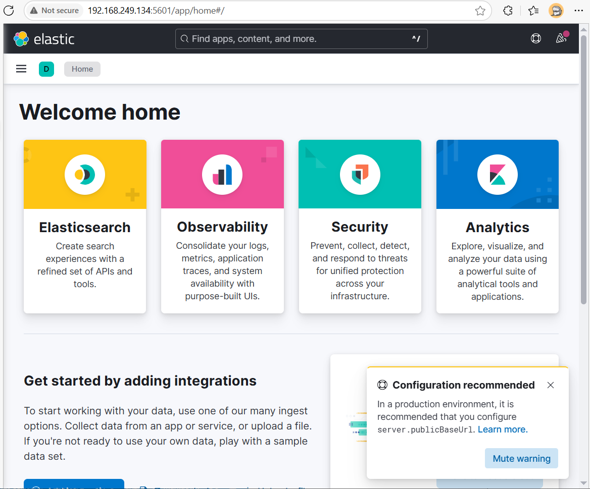

In this section, we will update the network to be more realistic by adding:

- A ELK server to collect and visualize logs from Suricata.
- A target DVWA webserver to test attacks.


# Install and setup DVWA webserver

In the VMware, create a new VM to install the DVWA webserver. You can use the same Ubuntu Server `iso` file as we did with the Suricata machine. The setup are similar to the Suricata machine, except for the last step where you need to choose additional packages to install Docker since we plan to run DVWA in a Docker container.


After the installation is complete, run the following commands to install Docker and run the DVWA container:

```bash
sudo docker run -d -p 80:80 vulnerables/web-dvwa
```
Then open the web browser on host machine, then access the DVWA webserver using the IP address of the VM. For example, if my VM's IP address is `192.168.249.133`:


Login with default credentials as `admin` and `password`.

Now we verify that the dvwa webserver is successfully installed. Let change the IP name of this Vm to match the IP address in the network diagram before packeting it to Pnetlab.

```bash
sudo apt update
sudo apt install iputils-ping nano -y #After change the IP, we will not have the Internet connection until we run this successfully in the Pnetlab, so before that, to configure it in Pnetlab, install nano and ping first.
sudo nano /etc/netplan/99-static-ip.yaml
```

Then use the following content to configure the static IP address for this VM:
```yaml
network:
  version: 2
  ethernets:
    # ens3 = eth0, webserver only have this interface
    ens3:
      dhcp4: no # Disable DHCP for this interface since we want to use static IP
      addresses: [10.0.0.4/24]
      routes:
        - to: default
          via: 10.0.0.1 # Router IP address
      nameservers:
        addresses: [8.8.8.8, 1.1.1.1]
```

Then save the file and apply the changes:

```bash
sudo netplan apply
```

Currently the VM can still be connect and the IP have showup yet since the interface `ens3` is not not avaialbe yet, only after we add this VM to Pnetlab and connect it to the router, then we can access it via the IP address `10.0.0.4`.


# Install and setup ELK server

Create a Ubuntu Server VM in VMware, choose the same Ubuntu Server `iso` file as we did with the Suricata machine. After created, SSH from host to this VM, then run the following commands:

```bash
sudo apt update
sudo apt install nano iputils-ping -y
curl -fsSL https://artifacts.elastic.co/GPG-KEY-elasticsearch | sudo gpg --dearmor -o /usr/share/keyrings/elastic.gpg # Add the GPG key for the Elastic repository
echo "deb [signed-by=/usr/share/keyrings/elastic.gpg] https://artifacts.elastic.co/packages/8.x/apt stable main" | sudo tee /etc/apt/sources.list.d/elastic-8.x.list
sudo apt update
sudo apt install elasticsearch
sudo systemctl enable elasticsearch
sudo systemctl start elasticsearch
sudo systemctl status elasticsearch # Make sure Elasticsearch is running
```

Then we need to allow connection to Elasticsearch from other machines (by default it only allows connection on localhost), so we need to edit the configuration file, uncommand this line:

```bash
sudo nano /etc/elasticsearch/elasticsearch.yml
```

Uncomment the line `network.host` and set it to `0.0.0.0`:

```yaml
# ---------------------------------- Network -----------------------------------
#
# By default Elasticsearch is only accessible on localhost. Set a different
# address here to expose this node on the network:
#
network.host: 0.0.0.0
```
This will allow Elasticsearch to listen on all network interfaces, making it accessible from other machines in the network. Then restart the Elasticsearch service:

```bash
sudo systemctl restart elasticsearch
sudo systemctl restart elasticsearch.service
systemctl daemon-reload
```
Then try a test HTTP:

```bash
curl -X GET http://192.168.249.134:9200
```
Replace with the IP address of your ELK server. You should see a JSON response with information about the Elasticsearch node.

```plainte
chutrunganh@elk:~$ curl -X GET http://192.168.249.134:9200
{
  "name" : "elkserver",
  "cluster_name" : "elasticsearch",
  "cluster_uuid" : "xVa6TWiiTiOtaeG0Ci722g",
  "version" : {
    "number" : "8.18.0",
    "build_flavor" : "default",
    "build_type" : "deb",
    "build_hash" : "04e979aa50b657bebd4a0937389308de82c2bdad",
    "build_date" : "2025-04-10T10:09:16.444104780Z",
    "build_snapshot" : false,
    "lucene_version" : "9.12.1",
    "minimum_wire_compatibility_version" : "7.17.0",
    "minimum_index_compatibility_version" : "7.0.0"
  },
  "tagline" : "You Know, for Search"
}
```

# Install and setup Kibana

On the same terminal that are connected to the ELK server, run the following commands to install Kibana (Elasticsearch and Kibana will run a a same server, in this lab we do not need to use Logstash):

```bash
sudo apt update
sudo apt install kibana
sudo systemctl enable kibana
sudo systemctl start kibana
sudo systemctl status kibana # Make sure Kibana is running
```

Then we need to allow connection to Kibana from other machines (by default it only allows connection on localhost), so we need to edit the configuration file, uncommand this line:

Run:

```bash
sudo nano /etc/kibana/kibana.yml
```
Uncomment the line `server.host` and set it to `0.0.0.0`:

```yaml
# =================== System: Kibana Server ===================
# Kibana is served by a back end server. This setting specifies the port to use.
#server.port: 5601
# Specifies the address to which the Kibana server will bind. IP addresses and host names are both valid values.
# The default is 'localhost', which usually means remote machines will not be able to connect.
# To allow connections from remote users, set this parameter to a non-loopback address.
server.host: 0.0.0.0
```

Then restart the Kibana service:

```bash
sudo systemctl restart kibana
```

Then open web browser on host machine, and access Kibana using the IP address of the ELK server. For example, if my ELK server's IP address is `192.168.249.134`.



# Install and setup Filebeat

On the Suruicata machine, we will install Filebeat to send logs to the ELK server. Run the following commands:

```bash
sudo apt update


After verify things work correctly, we can change the IP address of the ELK VM to match the IP address in the network diagram before packeting it to Pnetlab.

```bash
sudo nano /etc/netplan/99-static-ip.yaml
```

Then use the following content to configure the static IP address for the ELK VM:

```yaml
network:
  version: 2
  ethernets:
    # ens3 = eth0, ELK only have this interface
    ens3:
      dhcp4: no # Disable DHCP for this interface since we want to use static IP
      addresses: [10.0.0.3/24]
      routes:
        - to: default
          via: 10.0.0.1 # Router IP address
      nameservers:
        addresses: [8.8.8.8, 1.1.1.1]
```

Then save the file and apply the changes:

```bash
sudo netplan apply
```

The work flow will be as follow:

> [10.0.0.2: Suricata Server  + Filebeat sends logs ] --> [10.0.0.3: Elasticsearch + Kibana]


filebeat.inputs:
- type: log
  enabled: true
  paths:
    - /var/log/suricata/eve.json
  json.keys_under_root: true
  json.add_error_key: true

output.logstash:
  hosts: ["<Địa_chỉ_IP_ELK>:5044"]


 The common ways are Filebeat with the Suricata module, or pure logstash. While these store events in Elasticsearch differently, Kibana should still be able to discover them.

 Just direclty use fielkbeat: https://discuss.elastic.co/t/dashboards-for-suricata-filebeat-logstash-setup/372436/2

 Config ELK with Suricata Eng: https://www.digitalocean.com/community/tutorials/how-to-build-a-siem-with-suricata-and-elastic-stack-on-ubuntu-20-04

 https://www.criticaldesign.net/post/how-to-setup-a-suricata-ips-elk-stack

 Viet:

 https://123host.vn/community/tutorial/huong-dan-cai-dat-siem-dung-suricata-va-elastic-stack-tren-ubuntu-2004.html


Bước 2: Kích hoạt Suricata module trong Filebeat
Chạy lệnh sau:

bash
Copy
Edit
sudo filebeat modules enable suricata
Sau đó chỉnh sửa file module nếu cần:

bash
Copy
Edit
sudo nano /etc/filebeat/modules.d/suricata.yml
Đảm bảo dòng sau được bật:

yaml
Copy
Edit
- module: suricata
  eve:
    enabled: true
    var.paths:
      - /var/log/suricata/eve.json
✅ Mẹo: dùng filebeat modules list để kiểm tra suricata đã bật chưa.


