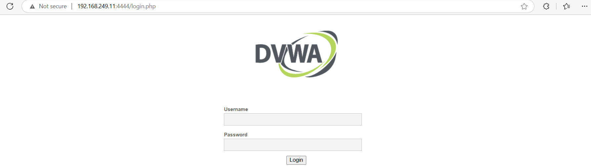

# WEb UI of DVWA

Remember to run docker on machine first:

docker run -d -p 80:80 vulnerables/web-dvwa

Tten from phýical hót machine access: 

http://192.168.249.11:4444/

# Access ELK

Remember to out nat port 5601

# Change fire beat in Suricat amchine: 

sudo nano /etc/filebeat/filebeat.yml

change Kinana and Elastich serach outpu tot 10.0.0.3
