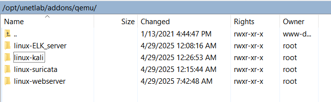
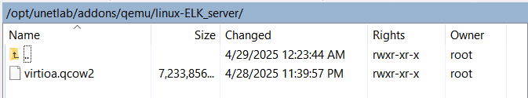
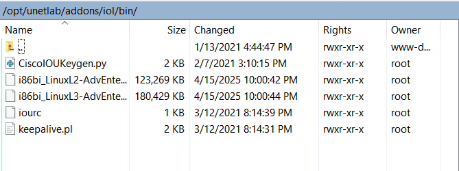
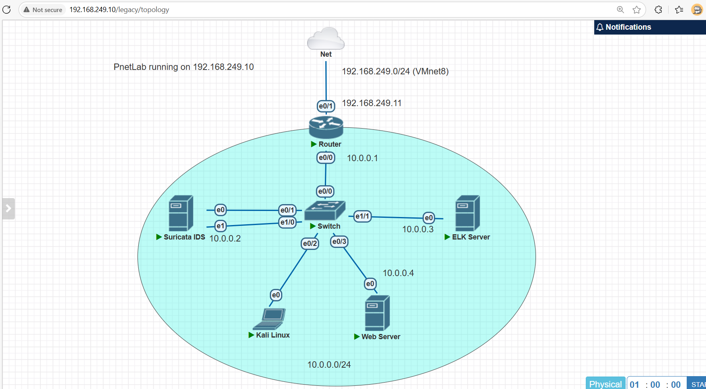
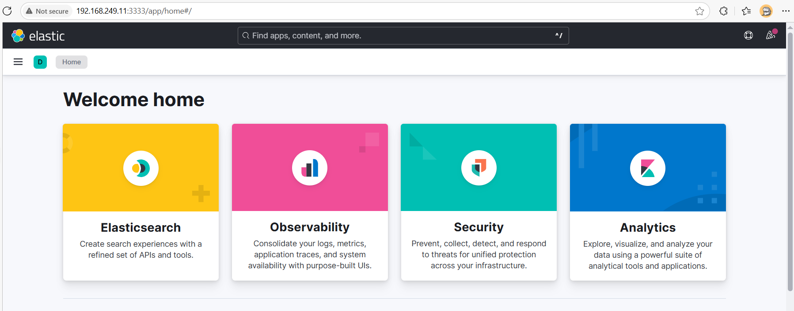
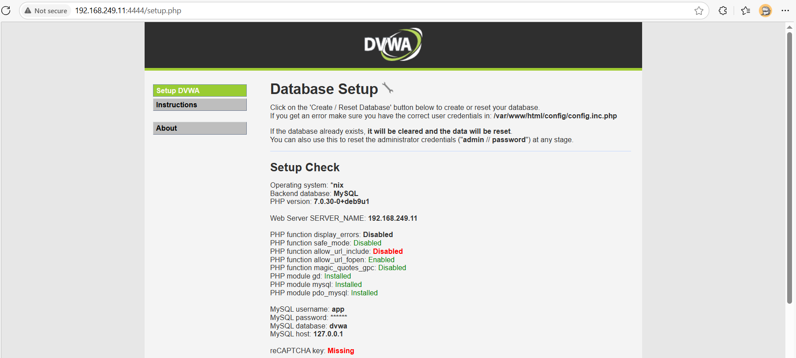
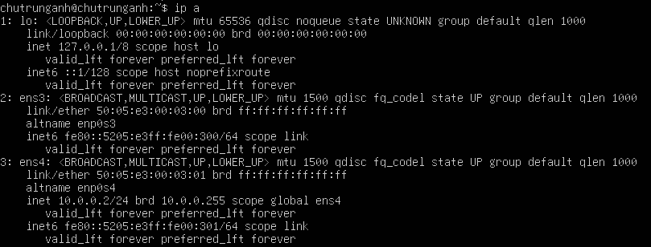
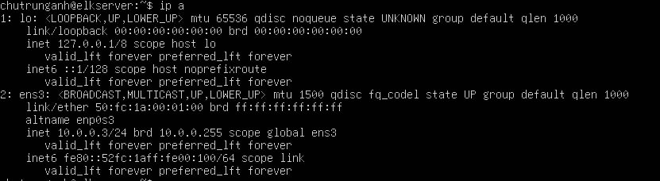
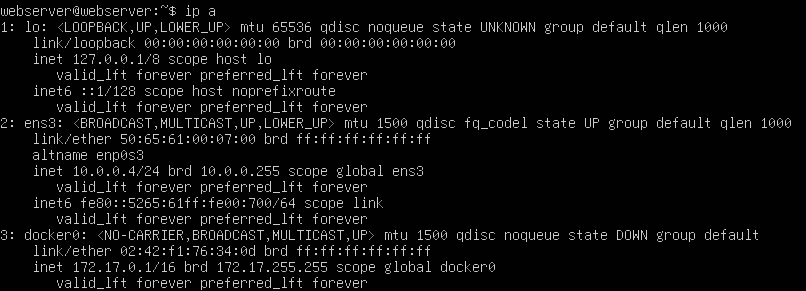
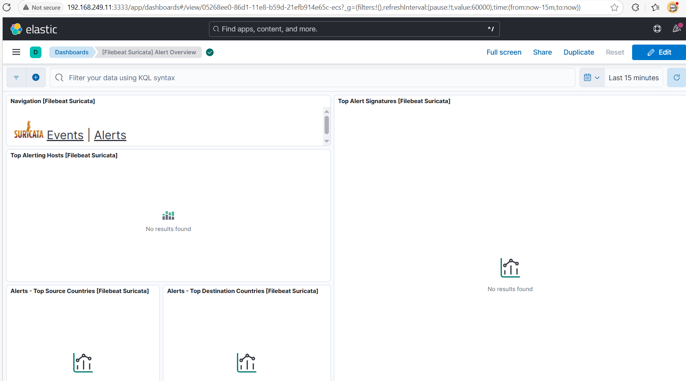

After setting up things as standalone VM in Vmware, we export them to `.vmdk` files -> convert them to `.qcow2` files using `qemu-img`, see instructions [here](../Appendix/Generate%20qcow2%20image%20files.md). Then import these machine in to thePnetLab (via CLI or GUI with WinSCP).

Here is the network topology we plan to build:


# Recheck everything

## Check for image files

After previously setting up the lab, we have all needed OS images, import them to PnetLab, named them like this:


*Folder structure in PnetLab VM, view by WinSCP*

Inside each OS images folder we have the `qcow2` files, which are the actual OS images.



> [!IMPORTANT]
> These folder names must be named exactly as `linux-<YOUR_PREFER_NAME>` and the image file must be `virtioa.qcow2` so that Pnetlab can recognize them correctly. Reread [2. Setup_prerequisites.md](2.%20Setup_prerequisites.md) for more details.

And here are images file for Cisco Router and Switch:



Remember to run: `/opt/unetlab/wrappers/unl_wrapper -a fixpermissions` after importing the images to ensure proper permissions are set.

All machines in PnetLab should be running and can be open by double-clicking on them in the GUI. Without any issues, we continue to check the IP addresses of the machines, configuration files. Open PnetLab at browser: `192.168.249.10`, then **turn on** all the devices:





## Check IP addresses

Recall in the [3. Setup_lab_prerequisites.md](3.%20Setup_lab_prerequisites.md) I have config NAT in router as follow:

```bash
...
ip nat inside source list 1 interface e0/1 overload # Enable NAT, so that devices inside the lab can access the internet
ip nat inside source static tcp 10.0.0.2 22 192.168.249.11 2222 # Enable port forwarding, I will explain in detail later
ip nat inside source static tcp 10.0.0.3 5601 192.168.249.11 3333 # PLACEHOLDER
ip nat inside source static tcp 10.0.0.4 80 192.168.249.11 4444 # PLACEHOLDER
...
```
Base on this configuration, and the IP addresses in the network topology, we have:

- The Suricata IDS (`10.0.0.2`) can be accessed via SSH from the host machine (actual physical machine) with `ssh chutrunganh@192.168.249.11 -p 2222` (Since i forwarded port `22` to `2222` on the host machine)

    ```plaintext
    PS C:\Users\Chu Trung Anh> ssh chutrunganh@192.168.249.11 -p 2222
    chutrunganh@192.168.249.11's password:
    Welcome to Ubuntu 24.04.2 LTS (GNU/Linux 6.8.0-58-generic x86_64)

    * Documentation:  https://help.ubuntu.com
    * Management:     https://landscape.canonical.com
    * Support:        https://ubuntu.com/pro
    ```
  
- The ELK Stack (`10.0.0.3`), the Kibana web interface can be accessed via host machine with `http://192.168.249.11:3333` (Since I forwarded port `5601` to `3333` on the host machine).
  
  
  
- The DVWA Webserver (`10.0.0.4`), the DVWA web interface can be accessed via host machine with `http://192.168.249.11:4444` (Since I forwarded port `80` to `4444` on the host machine).

    
    *Remember to check if the DVWA docker container is running with `sudo docker ps` command, if not, run it with `sudo docker run -d -p 80:80 vulnerables/web-dvwa`. Login with credentials as `admin`/`password` to the DVWA web interface, then set the security level to `low` in the DVWA settings.
Check the IP addresses of each machine in PnetLab, they should be like this:

- The Suricata IDS:
  
    

  - `ens3` (or `eth0` in the network topology) is the interface connected switch SPAN port, it does not have IP address, only receives traffic from the switch.
  - `ens4` (or `eth1` in the network topology) is the interface connected to the LAN, it has IP address `10.0.0.2`, main purpose is to send alerts to the ELK Stack.

- The ELK Stack: have IP address `10.0.0.3`



- The DVWA Webserver: have IP address `10.0.0.4`, main purpose is to host the DVWA web application.

*Since we run this DVWA using Docker so it has another interface `docker0` but this interface is not used in our lab.

- The Kali Linux machine receives IP via DHCP from the router.

Use `ping` command to check if the machines can reach each other and reach the INTERNET.

# Check configuration files


You can recall to the [4. Setup_lab_environment_update_with_ELK.md](./4.%20Setup_lab_environement_update_with_ELK.md) for the detail explaination of the configuration files. In this section, I will just recheck the IP addresses in the configuration files to see if any place we forgot to change from the previous lab setup. Only the Suricata IDS VM configuration files need to be checked (the Kibana use `localhost` to connect to Elasticsearch, Elasticsearch and DVWA Webserver do not have any configuration related to IP addresses). 

SSH to the Suricata IDS in PnetLab from host machine, then recheck the configuration files:

```bash
# Check Suricata configuration file
sudo nano /etc/suricata/suricata.yaml
```

Expected output:

```yaml
address-groups:
    HOME_NET: "[10.0.0.0/24]"

...

 # enable/disable the community id feature.
      community-id: true
...
af-packet:
  - interface: ens3
```

Check the Filebeat configuration file:

```bash
sudo nano /etc/filebeat/filebeat.yml
```

Expected output:

```yaml
# ================================= Dashboards =================================
# These settings control loading the sample dashboards to the Kibana index. Loading
# the dashboards is disabled by default and can be enabled either by setting the
# options here or by using the `setup` command.
setup.dashboards.enabled: true

# =================================== Kibana ===================================
setup.kibana:

  # Kibana Host
  host: "10.0.0.3:5601"

# ---------------------------- Elasticsearch Output ----------------------------
output.elasticsearch:
  # Array of hosts to connect to.
  hosts: ["10.0.0.3:9200"]

# Comment out the Logstash output section, we do not use Logstash in this lab
```

Then restart any services that you have changed the configuration files:

```bash
sudo systemctl restart <SERVICE_NAME>
```

After that, setup the Kibana dashboards and index patterns:

```bash
sudo filebeat setup --dashboards --pipelines --index-management
sudo filebeat setup --index-management
```
Recheck the Kibana web interface at `http://192.168.249.11:3333`, you should see the Filebeat index patterns and dashboards:



# Perform some attacks

Now we will try some attacks from the Kali Linux machine to the DVWA Webserver, and see if the Suricata IDS can detect them and send alerts to the ELK Stack.


