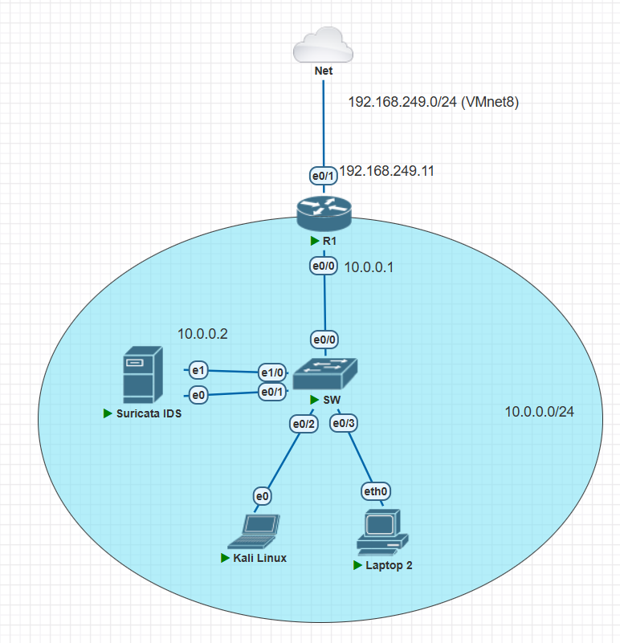

# Project2: Research and Deploy Suricata IDS

> [!NOTE]  
> 🚧 **This project is currently under development** 🚧

This project focuses on researching and deploying **Suricata IDS (Intrusion Detection System)** in a simulated enterprise network environment. The goal is to understand how a typical IDS/IPS works under the hood and explore a practical case: Suricata IDS, to see how it can be used to monitor network traffic, detect potential threats, and integrate with other tools for logging and alerting.

---

## 🎯 Key Objectives
- Set up a simulated enterprise network using the **PnetLab** emulator.
- Deploy and configure **Suricata IDS** within a network to monitor traffic and detect intrusions.
- Integrate Suricata with tools like the **ELK Stack** for centralized logging and alerting.
- Test and validate the IDS by simulating various attack scenarios.

### 🖼️ Current Network Topology

---

## 📌 Current Status

The lab environment has been partially set up, including:
- A Cisco router and switch for network simulation.
- Virtual machines running **Ubuntu Server** and **Kali Linux**.
- Initial configuration of **Suricata IDS** and network components.

**For detailed configuration and setup, please refer to the `.md` file inside the [LabSetup folder](LabSetup).**

**For theoretical background on IDS, please refer to the [Report file](Project2_Report.pdf).**

---

## 🛠️ Future Work
- [ ] Complete the integration of Suricata with the ELK Stack.
- [ ] Simulate and analyze various attack scenarios.
- [ ] Document findings and best practices for deploying Suricata in real-world environments.

---

## 🧰 Tools and Technologies
- **PnetLab**: For network simulation.
- **VMware Workstation**: To run virtual machines.
- **Suricata IDS**: For intrusion detection.
- **Kali Linux**: For penetration testing and attack simulation.
- **ELK Stack** (planned): For centralized logging and alerting.

