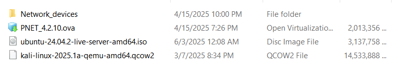
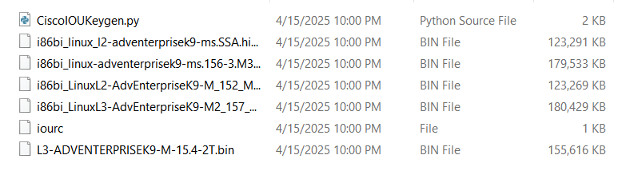

# Project2: Research and Deploy Suricata IDS

📌 This project focuses on researching and deploying **Suricata IDS (Intrusion Detection System)** in a simulated enterprise network environment. The goal is to understand how a typical IDS/IPS works under the hood and explore a practical case study: Suricata IDS, to see how it can be used to monitor network traffic, detect potential threats, and integrate with other tools for logging and alerting.

---

## 🎯 Key Objectives
- Set up a simulated enterprise network using the **PnetLab** emulator.
- Deploy and configure **Suricata IDS** within a network to monitor traffic and detect intrusions.
- Integrate Suricata with tools like the **ELK Stack** for centralized logging and alerting.
- Test and validate the IDS by simulating various attack scenarios.

## 🖼️ Network Topology

The lab environment contains the following components:

- **Net**: PnetLab NAT adapter that allows all VMs inside the simulated network access to the Internet.

- A Cisco **router** and a Cisco **switch** for network traffic routing:

    - The switch is configured to use **SPAN** ports (Switched Port Analyzer), which will make copies of traffic from `e0/2` and `e0/3` interfaces send to the `e0/1` interface, where Suricata IDS is running.
    - The router is configured to route traffic and NAT ports for SSH and HTTP from VMs inside PnetLab to the host machine.
  
- **Suricata IDS** monitors traffic from the SPAN port on the `e0` interface and sends alerts/logs via the `e1` interface.
- **ELK Server** contains Elasticsearch and Kibana for centralized logging and visualization.
- **Webserver** running DVWA (Damn Vulnerable Web Application) to simulate a vulnerable application for testing purposes via a docker container.

- **Kali Linux** VM for penetration testing and simulating attacks against the webserver. The attack samples can be found in the [attack-sample](./attack-sample/) folder.

## 📝 Documentation

- For the theoretical background of IDS, see [Project2_Report.pdf](./Project2_Report.pdf).

- For the detailed step-by-step guide on how to set up the lab environment, see [LabSetup](./LabSetup/).

## 🧰 Tools and Resources Used

- Software:

  - **PnetLab** software: For network simulation.
  - **VMware Workstation** software: To run virtual machines.
 
- **Image files**:
  - **PnetLab images**: Run the PnetLab simulator. Download [here](https://pnetlab.com/pages/download).
  
  - **Ubuntu Server 24.04.2 LTS**: Dedicated server to run Suricata IDS, ELK Stack, and DVWA. Download [here](https://ubuntu.com/download/server).
  
  - **Kali Linux**: For penetration testing and attack simulation. Download [here](https://www.kali.org/get-kali/#kali-virtual-machines) (Choose the Pre-built Virtual Machines for Qemu option).
  
  - **Cisco** i86bi_LinuxL2 as switch and i86bi_LinuxL3 as router images for the lab environment, included in [Network_devices](./ISO_Files/Network_devices/) folder.

    

    *All images you will need to run the lab*

    

    *Inside the `Network_devices` folder. Unzip the files, recheck the file extension before importing them into PnetLab.*

## 🛠️ Future Work
- [ ] Send alerts from ELK to Gmail, Telegram, or other notification systems.
- [ ] Integrate anomaly detection capabilities into Suricata IDS.
